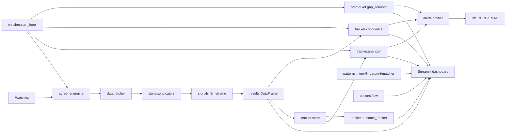

# TradeX Architecture Review

## Repository map

```text
TradeX/
├── pyproject.toml              # Python 3.11+, uv/pip installable
├── .env.example                # Credential and threshold template
├── SETUP.md                    # Agent-oriented setup guide
├── README.md                   # User-facing overview
├── CLAUDE.md                   # Developer/project context
├── launchers/                  # macOS .app and Windows .bat/.ps1
├── scripts/                    # Schwab OAuth bootstrap
├── docs/                       # Audit and (proposed) decision records
├── research/                   # Proposed home for experiments
├── tradex/
│   ├── data/fetcher.py         # Multi-provider OHLCV fetch + normalization
│   ├── signals/
│   │   ├── indicators.py       # Shared RSI/MACD/EMA/BB/ATR/volume
│   │   ├── intraday.py         # 5m/5d scorer
│   │   ├── short_term.py       # 1d/60d scorer
│   │   ├── long_term.py        # 1wk/2y scorer
│   │   └── weights.py          # User-tunable weights + UI help metadata
│   ├── screener/engine.py      # Multi-threaded watchlist scanner
│   ├── tracker/
│   │   ├── store.py            # SQLite signal history + scan audit
│   │   ├── analyzer.py         # Coil detector
│   │   ├── confluence.py       # Cross-timeframe scoring
│   │   ├── outcome_tracker.py  # Post-signal price outcomes
│   │   └── watcher.py          # Scheduled scan loop
│   ├── patterns/
│   │   ├── config.py           # PatternConfig + profiles
│   │   ├── miner.py            # Historical event mining
│   │   ├── fingerprint.py      # Averaged pre-event fingerprints
│   │   └── matcher.py          # Live-vs-fingerprint similarity
│   ├── premarket/gap_scanner.py
│   ├── options/flow.py
│   ├── alerts/notifier.py
│   ├── earnings/calendar.py
│   ├── watchlists/
│   │   ├── store.py
│   │   ├── presets.py
│   │   └── refresh.py
│   └── ui/dashboard.py         # Streamlit UI (1,721 lines)
└── tests/                      # Introduced by this audit (characterization suite; CI still missing)
```

## Data-flow diagram



## Module responsibility map

| Module | Owns | Should not own | Inputs | Outputs |
|---|---|---|---|---|
| `data.fetcher` | Fetching OHLCV from configured provider; normalizing column names and basic index shape. | Indicator computation, trading logic, alert delivery. | `ticker`, `timeframe`, optional `provider` | `pd.DataFrame` with `open/high/low/close/volume` |
| `signals.indicators` | Computing standard technical indicators on a DataFrame. | Provider-specific parsing, scoring decisions. | `pd.DataFrame` | Same DataFrame with indicator columns |
| `signals.*timeframe` | Scoring a single normalized DataFrame for one timeframe. | Cross-timeframe logic, UI concerns. | DataFrame, optional weights | `dict` with `score`, `reasons`, etc. |
| `signals.weights` | Loading/saving user-tunable weight values. | UI labels and help text (those belong with the dashboard or a config module). | Filesystem JSON | `Weights` dataclass |
| `screener.engine` | Running a scorer across a watchlist and filtering by `min_score` / earnings. | Persistence, scheduling, alerting. | Tickers, timeframe, filters | Ranked `pd.DataFrame` of passing tickers |
| `tracker.store` | Writing/reading signal history and scan audit records. | Scoring, scheduling. | Results DataFrame, query params | DataFrames/rows |
| `tracker.analyzer` | Detecting coils and trends from stored history. | Fetching data, persisting. | History DataFrame | Coil DataFrame / state dict |
| `tracker.confluence` | Combining scores across timeframes for a single ticker or watchlist. | Data fetching beyond delegating to `fetcher`. | Ticker/watchlist | Confluence score / DataFrame |
| `tracker.outcome_tracker` | Fetching post-signal closes and recording outcomes. | Trading decisions, UI. | Pending signal rows | Updated DB rows / summary |
| `tracker.watcher` | Running scans on a schedule and triggering alert checks. | Computing indicators, sending alerts directly. | Tickers, interval, thresholds | Side effects (DB, alerts) |
| `patterns.*` | Mining, averaging, and matching historical event windows. | Live trade execution, UI. | Historical/live DataFrames | Fingerprint dicts / match results |
| `options.flow` | Fetching and normalizing options chain/flow data. | Interpreting flow as a trade signal. | Ticker / watchlist | Options chain DataFrame / sentiment dict |
| `alerts.notifier` | Sending threshold alerts over Discord/email. | Deciding *when* to alert (that belongs in `watcher` or a dedicated alert policy). | Alert payload | HTTP/SMTP side effects |
| `watchlists.*` | Storing, loading, and refreshing watchlists. | Signal logic, data fetching. | Names/tickers/universe | Lists of tickers / refreshed presets |
| `earnings/calendar` | Caching next earnings dates. | Trading logic. | Ticker | Days until earnings / date |
| `ui/dashboard.py` | Presenting controls and results to the user. | Indicator computation, persistence, scheduling, alert sending. | All backend functions | Rendered Streamlit UI |

## Architecture findings

### 1. `ui/dashboard.py` has accumulated too many responsibilities
At 1,721 lines it is the largest file in the project. It imports and directly calls nearly every backend module, encodes UI labels and help text, draws Plotly charts, and manages watchlist state. This makes the UI hard to test and couples Streamlit presentation to trading calculations.

**Recommended fix (later PR):** extract `ui/components/` modules for each tab; keep `dashboard.py` as a thin router. Move help text and component metadata to a `ui/config.py` or `ui/help.py`.

### 2. Global configuration is loaded at import time
Several modules call `load_dotenv()` at the top and read `os.getenv(...)` into module-level constants (`fetcher.py`, `notifier.py`, `options/flow.py`). This makes testing awkward and means behavior depends on the environment in which the module is first imported.

**Recommended fix:** Read config once at startup (e.g., a `tradex/config.py` or via a `Settings` dataclass) and pass explicit parameters to functions/classes. At minimum, avoid `os.getenv` in hot paths.

### 3. Provider abstraction is functional but not pluggable enough
`data.fetcher` uses a dispatch dictionary of functions. This works, but adding a new provider means editing `fetcher.py`. There is no shared interface or contract test that each provider must satisfy.

**Recommended fix:** Define a `DataProvider` protocol/ABC with `fetch(ticker, timeframe) -> pd.DataFrame` and `provider_name`. Register providers in a registry. Add provider-contract tests that verify columns and index shape for all providers.

### 4. Hidden coupling between persistence modules
`tracker.outcome_tracker` does `from tradex.tracker.store import DB_PATH, _conn, _ensure_db_dir`. It references the store's private helpers and a global `DB_PATH`. If the schema or location of signal history changes, both modules must be updated.

**Recommended fix:** Expose a public `store.get_connection()` or `store.with_connection()` context manager and a single `DB_PATH` source of truth.

### 5. Pattern matcher hardcodes the "short" timeframe
`patterns/matcher.py` always calls `fetch(ticker, "short")` regardless of what the user is analyzing. A user running the pattern matcher from the intraday or long-term context still gets daily bars.

**Recommended fix:** Accept a `timeframe` or `lookback` parameter in `match_ticker` and propagate it from the UI.

### 6. `signals.weights.py` mixes domain and UI metadata
`COMPONENT_LABELS` contains Streamlit-oriented help strings and labels. This couples signal logic to dashboard presentation.

**Recommended fix:** Move component metadata (label, tooltip) to the dashboard or a separate `ui/signal_config.py`. Keep `weights.py` focused on serialization and defaults.

### 7. Options flow mixes data acquisition, parsing, and signal interpretation
`options/flow.py` has Unusual Whales, Tradier, and yfinance fetchers plus `scan_unusual_flow` and `get_put_call_sentiment`. Without credentials it silently degrades to a free chain that is not "flow" data.

**Recommended fix:** Split into provider adapters (`unusual_whales.py`, `tradier.py`, `yfinance_chain.py`) and a separate `options/aggregator.py` that decides which source to use. Do not present yfinance chain data as unusual flow.

### 8. No research-code isolation
There is no `research/` or `notebooks/` directory. Experiments could be created at the repo root and accidentally become production logic.

**Recommended fix:** Add `research/` with a README requiring every experiment to document hypothesis, universe, period, signal, entry/exit, costs, results, and decision.

## Best-practice recommendations

| Practice | Current state | Target |
|---|---|---|
| **Tests** | This audit adds an initial `tests/` tree with 7 strict xfails and 1 passing test. | `tests/` mirroring `tradex/`; unit, integration, and provider-contract tests. |
| **CI** | None | GitHub Actions running `uv sync --extra dev`, `pytest`, and `ruff check tests` on PRs. |
| **Lint/typecheck** | `ruff` configured in `pyproject.toml`; `mypy` not configured | Run `ruff check` in CI. Add `mypy` only after it is configured and an agreed baseline is established. |
| **Configuration** | `.env` + module-level globals | A single typed `Settings` object or `config.py`; env vars read at startup. |
| **Logging** | `print` statements throughout | Use the `logging` module with levels; replace `print` in production paths. |
| **Error handling** | Broad `except Exception: return None/empty` | Distinguish user-facing, retryable, and provider-specific errors; surface failures instead of silently returning empty results. |
| **Timezones** | `datetime.now(timezone.utc)` and `schedule` local time | Explicit US/Eastern market timezone; market-hours checks; convert all displayed times to ET. |
| **Market-hours awareness** | None in watcher | Skip scheduled scans outside market hours or make it configurable. |
| **Alert policy** | Alert on every threshold crossing | Add cooldown, deduplication, and "alert state" persistence. |

## Maintainability concerns

- **Dashboard size** makes it likely to accumulate duplicate logic and makes code review difficult.
- **Global mutable state** (`_SCHWAB_CLIENT`, `load_dotenv` side effects, module-level DB constants) complicates tests and can cause leakage across sessions.
- **Duplicate yfinance MultiIndex handling** appears in `data/fetcher.py`, `premarket/gap_scanner.py`, `patterns/miner.py`, and `tracker/outcome_tracker.py`. `outcome_tracker.py` is missing this handling, which is the source of a confirmed crash.
- **No schema migrations** for SQLite. As the signal-history schema evolves, existing `~/.tradex/signals.db` files must be migrated or versioned.
- **Lack of observability** makes it hard to know whether the watcher is running, whether scans are failing, or why a result is empty.
