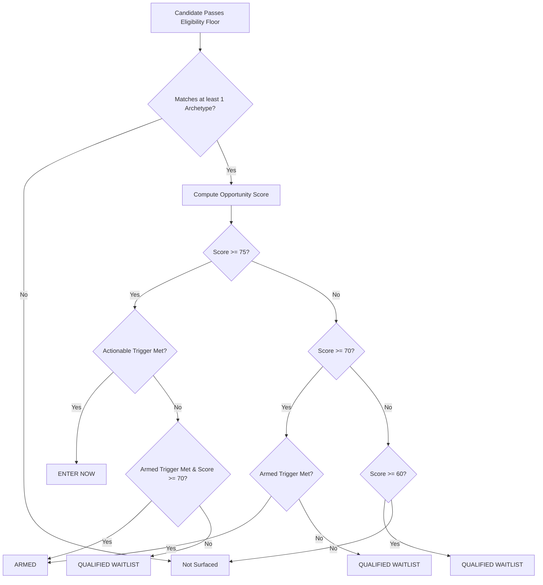

# LONG-MVP-001: Production-Target Long Opportunity Strategy v1 Contract

**Document ID:** `LONG-MVP-001`  
**Classification:** Production-target strategy design and interface contract  
**Status:** Approved design contract (Documentation-only)  
**Affects current trading behavior:** No  
**Base commit SHA:** `c333c89c6baca6ae7837d9edfe21823539ee4c3c`  
**Target implementation PR:** `LONG-MVP-002` (requires Gary Yang's explicit approval before merge)  
**Production strategy authorization:** `APPROVED_PRODUCTION_STRATEGIES = ()` (unchanged)  

---

## 1. Verified Current Behavior

Repository evidence at base SHA `c333c89c6baca6ae7837d9edfe21823539ee4c3c` establishes the current production-facing long scoring architecture:

### 1.1 Legacy Long Scorer
The active production-facing long scorer in [`tradex/signals/long_term.py`](../../tradex/signals/long_term.py) is a weekly-bar heuristic combining five additive technical conditions:
1. **Secular uptrend:** `close > EMA50` (awarded `weights.secular_uptrend`, default 25 pts)
2. **RSI healthy:** `40 <= RSI <= 65` (awarded `weights.rsi_healthy`, default 20 pts)
3. **Volume accumulation:** 8-period mean `volume_ratio >= 1.15` (awarded `weights.volume_accumulation`, default 25 pts)
4. **MACD bullish bias:** `macd > macd_signal` on weekly bars (awarded `weights.macd_bullish`, default 15 pts)
5. **Bollinger Band coil:** `bb_width` percentile ranking `< 0.25` on weekly bars (awarded `weights.bb_coil`, default 15 pts)

The function returns:
```python
{
    "score": min(sum(signals), 100),
    "reasons": reasons,
    "last_close": last["close"],
    "volume_ratio": last["volume_ratio"],
    "rsi": last["rsi"],
}
```

### 1.2 Data Timeframe Preset
In [`tradex/data/fetcher.py`](../../tradex/data/fetcher.py), the OHLCV timeframe presets are:
```python
TIMEFRAMES = {
    "intraday": {"period": "5d", "interval": "5m"},
    "short": {"period": "60d", "interval": "1d"},
    "long": {"period": "2y", "interval": "1wk"},
}
```
The legacy long timeframe requests weekly candles (`interval = 1wk`), which creates a structural mismatch with multi-day swing holding horizons.

### 1.3 User-Tunable Weights
In [`tradex/signals/weights.py`](../../tradex/signals/weights.py), `LongWeights` is loaded from `~/.tradex/weights.json` and exposed in the Streamlit UI Settings tab. A user can alter long scoring weights arbitrarily, making scoring non-deterministic across environments.

### 1.4 Screener and Confluence Integration
- In [`tradex/screener/engine.py`](../../tradex/screener/engine.py), the screener iterates through tickers, fetches OHLCV data using `TIMEFRAMES[timeframe]`, checks `len(df) >= 30`, and builds canonical result rows with fields `(ticker, score, last_close, volume_ratio, rsi, days_until_earnings, reasons, provider)`.
- In [`tradex/tracker/confluence.py`](../../tradex/tracker/confluence.py), multi-timeframe confluence applies fixed weights (intraday 30%, short 40%, long 30%), expecting each scorer to provide at least `score`, `reasons`, and `last_close`.

### 1.5 Strategy Authorization Registry
In [`tradex/strategies/registry.py`](../../tradex/strategies/registry.py), `APPROVED_PRODUCTION_STRATEGIES = ()` is strictly empty. No automated trading, journal execution, or automatic alerts are currently authorized for any strategy.

### 1.6 Research Disposition
The prior research program `LONG-002` completed development dataset construction, outcome census, VAM5 baseline freezing, feature registry freeze, Round-1 candidate search (`LONG-002E1`), and logistic stability diagnostics (`LONG-002E2`, yielding `no_bounded_regime_hypothesis_supported`). That extensive research provides valuable background evidence but is now closed as background research. It is superseded by `LONG-MVP-001` and `LONG-MVP-002` for product implementation.

---

## 2. Product Goal

TradeX requires an actionable, explainable, and deterministic long-side opportunity engine in production.

**Primary Product Question:**  
> *"Which liquid established stocks have technically credible long setups that could produce a meaningful upward move over the next several days to several weeks?"*

**Design Tenets:**
- **Explainable & Transparent:** Every score is built from grounded, intuitive technical rules. No black-box machine learning models, GBDT ensembles, or logistic regressions.
- **Multi-Archetype Recognition:** Long-side market opportunities present in distinct structural patterns. Rather than forcing all candidates through a single uniform rule, the engine evaluates three classic market archetypes:
  1. *Momentum Continuation* (trend persistence)
  2. *Trend Pullback* (mean-reversion within trend)
  3. *Breakout / Expansion* (volatility expansion from consolidation)
- **Deterministic & Un-tunable:** Weights and thresholds are fixed strategy contract invariants. Users cannot silently alter long strategy parameters via local config files.
- **Actionable State Model:** Surfaced candidates are classified into crisp execution readiness states: `ENTER NOW`, `ARMED`, or `QUALIFIED WAITLIST`.

---

## 3. Strategy Horizon and Data Timeframe

- **Strategy Trading Horizon:** 5 to 21 trading sessions (swing opportunity window).
- **Timeframe:** **DAILY OHLCV bars** (replacing the legacy weekly bars).
- **Target Historical Lookback:** Approximately 2 years of daily history (~500 sessions, minimum 220 usable daily bars) to accurately compute:
  - Moving averages: EMA20, EMA50, EMA200
  - Volatility: ATR14 and ATR percentage (`ATR14 / close`)
  - Momentum: RSI14, 5-session return, 20-session return, 60-session return
  - Price structure: prior 5-session high, prior 20-session high, distance to EMA20, EMA20 slope
  - Liquidity: 20-session volume SMA, 20-session relative volume, 20-session median dollar volume

---

## 4. MVP Eligibility Floor

Before evaluating any archetype or awarding points, a stock must satisfy all five structural and liquidity gates. These are absolute qualification requirements, not scoring bonuses:

1. **Sufficient Daily History:** At least **220 usable daily bars**.
2. **Minimum Price Floor:** Latest `close >= $5.00`.
3. **Institutional Liquidity Floor:** 20-session median dollar volume (`median(close_t * volume_t)` over 20 sessions) `>= $20,000,000` ($20M).
4. **Long-Term Trend Reference Availability:** EMA200 is available as a valid finite numeric value.
5. **Long-Term Bullish Structure:**
   $$\text{close} > \text{EMA50} \quad \text{AND} \quad \text{EMA50} > \text{EMA200}$$

**Fail-Closed Policy on Missing Data:**  
If any required input (OHLCV bars, volume, indicators) is missing, corrupt, non-numeric, or insufficient:
- Do not fabricate values.
- Do not substitute zero or arbitrary proxies.
- Do not silently pass the gate.
- Return an explicit non-qualified result: `qualified = False`, with failure reason recorded in `reasons` and observation status `INSUFFICIENT_DATA`.

---

## 5. Common Feature Set and Technical Definitions

All features are calculated deterministically on daily OHLCV bars:

| Feature Identifier | Formula / Definition | Technical Purpose |
|---|---|---|
| `close` | Latest session closing price ($close_t$) | Baseline price reference |
| `EMA20` | 20-period Exponential Moving Average of `close` | Short-term trend and pullback support |
| `EMA50` | 50-period Exponential Moving Average of `close` | Intermediate-term trend support |
| `EMA200` | 200-period Exponential Moving Average of `close` | Secular macro trend baseline |
| `RSI14` | 14-period Relative Strength Index (Wilder's smoothing) | Momentum speed and exhaustion gauge |
| `ATR14` | 14-period Average True Range (Wilder's smoothing) | Absolute daily volatility measure |
| `ATR_pct` | `ATR14 / close` | Normalized movement capacity percentage |
| `volume_sma20` | 20-period rolling simple moving average of `volume` | Baseline session volume |
| `volume_ratio_20` | `volume / volume_sma20` | Relative volume participation |
| `median_dollar_volume_20` | 20-period rolling median of `(close * volume)` | Liquidity and institutional capacity floor |
| `return_5` | `(close_t / close_{t-5}) - 1.0` | 5-session momentum |
| `return_20` | `(close_t / close_{t-20}) - 1.0` | 20-session momentum |
| `return_60` | `(close_t / close_{t-60}) - 1.0` | 60-session momentum (quarterly trend) |
| `prior_5d_high` | $\max(\text{high}_{t-5}, \dots, \text{high}_{t-1})$ | High of prior 5 sessions (excluding current bar) |
| `prior_20d_high` | $\max(\text{high}_{t-20}, \dots, \text{high}_{t-1})$ | High of prior 20 sessions (excluding current bar) |
| `distance_to_ema20_pct` | `(close - EMA20) / EMA20` | Proximity to short-term moving average |
| `distance_to_20d_high_pct`| `(prior_20d_high - close) / prior_20d_high` | Distance below recent 20-session high |
| `ema20_slope_5` | `EMA20_t - EMA20_{t-5}` (or `EMA20_t > EMA20_{t-5}`) | Directional slope of short-term moving average |

*Disallowed in LONG MVP v1:* No fundamentals, earnings surprises, analyst ratings, options flow, sentiment scoring, LLM outputs, or machine-learning model inference.

---

## 6. The Three Strategy Archetypes

TradeX LONG MVP v1 models three distinct, established market setup archetypes:

### 6.1 Archetype 1 — Momentum Continuation (`momentum_continuation`)
- **Intent:** Surface liquid leaders displaying sustained, orderly upward momentum without being structurally overextended.
- **Minimum Setup Conditions:**
  1. Eligibility floor passes.
  2. Full bullish moving-average alignment:  
     $$\text{close} > \text{EMA20} > \text{EMA50} > \text{EMA200}$$
  3. Persistent intermediate momentum: `return_20 >= +5%` (+0.05).
  4. Strong multi-month trend: `return_60 >= +10%` (+0.10).
  5. Proximity to highs: `close` is within 5% of `prior_20d_high`  
     $$\text{close} \ge 0.95 \times \text{prior\_20d\_high}$$
  6. Healthy momentum zone: `50 <= RSI14 <= 75`.
- **Trading Interpretation:** *"Strong existing trend with persistent medium-term momentum and close proximity to highs, indicating continuation potential."*

### 6.2 Archetype 2 — Trend Pullback (`trend_pullback`)
- **Intent:** Identify established bullish trends that have undergone an orderly short-term pullback to moving-average support without violating structural trend integrity.
- **Minimum Setup Conditions:**
  1. Eligibility floor passes.
  2. Primary moving-average trend intact:  
     $$\text{EMA20} > \text{EMA50} > \text{EMA200}$$
  3. Multi-month trend intact: `return_60 >= +10%` (+0.10).
  4. Primary support held: `close > EMA50`.
  5. Controlled short-term retracement: `return_5` between `-8%` and `+2%` (`-0.08 <= return_5 <= +0.02`).
  6. Proximity to EMA20: price within 4% of EMA20  
     $$\frac{|\text{close} - \text{EMA20}|}{\text{EMA20}} \le 0.04$$
  7. Reset momentum: `40 <= RSI14 <= 62`.
- **Trading Interpretation:** *"Strong larger trend undergoing a healthy short-term reset near EMA20 support while primary trend structure remains intact."*
- *Design Note:* Pullbacks naturally display flat or negative 5-session returns; the archetype is intentionally structured not to penalize short-term negative momentum.

### 6.3 Archetype 3 — Breakout / Expansion (`breakout_expansion`)
- **Intent:** Identify strong trending stocks consolidating at resistance or pressing out of a 20-session range with participation confirming the breakout.
- **Minimum Setup Conditions:**
  1. Eligibility floor passes.
  2. Bullish moving-average trend:  
     $$\text{EMA20} > \text{EMA50} > \text{EMA200}$$
  3. Proximity to or above resistance: `close` is within 2% below `prior_20d_high` OR above it  
     $$\text{close} \ge 0.98 \times \text{prior\_20d\_high}$$
  4. Momentum range: `50 <= RSI14 <= 78`.
- **Breakout Sub-Conditions:**
  - **Confirmed Breakout:** `close > prior_20d_high` AND `volume_ratio_20 >= 1.30`.
  - **Near-Breakout:** $0.98 \times \text{prior\_20d\_high} \le \text{close} \le \text{prior\_20d\_high}$.
- **Trading Interpretation:** *"Strong trend consolidating at recent highs with potential for range expansion; confirmation occurs on an actual break with volume."*

---

## 7. Opportunity Scoring Engine (100 Points Total)

Every candidate is evaluated on a single, explainable 0–100 point scale across five locked categories:

$$\text{Opportunity Score} = \text{Trend Quality (30)} + \text{Momentum Quality (25)} + \text{Setup Quality (20)} + \text{Movement Capacity (15)} + \text{Participation (10)}$$

### 7.1 Trend Quality (30 Points) — Universal
Evaluates moving-average alignment and short-term trend direction across all archetypes:
- `close > EMA20`: **8 points**
- `EMA20 > EMA50`: **8 points**
- `EMA50 > EMA200`: **8 points**
- `EMA20` rising vs 5 sessions earlier (`EMA20_t > EMA20_{t-5}`): **6 points**
- **Category Maximum: 30 points**

### 7.2 Momentum Quality (25 Points) — Archetype-Aware
Momentum expectations differ between continuation/breakout and pullback setups:

#### For `momentum_continuation` and `breakout_expansion`:
- `return_20 > 0`: **5 points**
- `return_20 >= +5%`: **5 additional points** (10 points total for return_20)
- `return_60 > 0`: **5 points**
- `return_60 >= +10%`: **5 additional points** (10 points total for return_60)
- `return_5 > 0`: **5 points**
- **Category Maximum: 25 points**

#### For `trend_pullback`:
- `return_60 > 0`: **5 points**
- `return_60 >= +10%`: **5 additional points** (10 points total for return_60)
- `return_20 > 0`: **5 points**
- `return_5` between `-8%` and `0%` (`-0.08 <= return_5 <= 0.0`): **5 points**
- `RSI14` between 40 and 60 (`40 <= RSI14 <= 60`): **5 points**
- **Category Maximum: 25 points**

### 7.3 Setup Quality (20 Points) — Archetype-Specific
Measures specific structural readiness for each archetype:

#### For `momentum_continuation`:
- `close` within 3% of `prior_20d_high` (`close >= 0.97 * prior_20d_high`): **8 points**
- `RSI14` between 55 and 70 (`55 <= RSI14 <= 70`): **6 points**
- `return_5` between `0%` and `+8%` (`0.0 <= return_5 <= 0.08`): **6 points**
- **Category Maximum: 20 points**

#### For `trend_pullback`:
- Distance to `EMA20 <= 2%` ($|\text{close} - \text{EMA20}| / \text{EMA20} \le 0.02$): **8 points**
- `close > EMA20`: **6 points** *(Note: If price is slightly below EMA20 but satisfies archetype conditions, it receives 0 points for this item but is not disqualified)*
- `return_5` between `-6%` and `0%` (`-0.06 <= return_5 <= 0.0`): **6 points**
- **Category Maximum: 20 points**

#### For `breakout_expansion`:
- `close > prior_20d_high`: **10 points**
- `volume_ratio_20 >= 1.30`: **6 points**
- Latest session `close > previous session close` (`close_t > close_{t-1}`): **4 points**
- **Category Maximum: 20 points**

### 7.4 Movement Capacity (15 Points) — Universal
Measures the stock's natural ability to produce meaningful percentage moves using normalized volatility (`ATR_pct = ATR14 / close`):
- `2.0% <= ATR_pct <= 6.0%`: **15 points** (sweet spot for swing movement)
- `1.5% <= ATR_pct < 2.0%`: **10 points**
- `6.0% < ATR_pct <= 8.0%`: **10 points**
- `1.0% <= ATR_pct < 1.5%`: **5 points**
- `ATR_pct > 8.0%`: **5 points** (excessive tail risk)
- `ATR_pct < 1.0%`: **0 points** (insufficient movement capacity)
- **Category Maximum: 15 points**

### 7.5 Participation (10 Points) — Universal
Measures institutional turnover conviction using relative volume (`volume_ratio_20 = volume / volume_sma20`):
- `volume_ratio_20 >= 1.50`: **10 points**
- `1.20 <= volume_ratio_20 < 1.50`: **8 points**
- `1.00 <= volume_ratio_20 < 1.20`: **6 points**
- `0.80 <= volume_ratio_20 < 1.00`: **3 points**
- `volume_ratio_20 < 0.80`: **0 points**
- **Category Maximum: 10 points**

---

## 8. Multiple Archetype Matching and Primary Setup Selection

A stock may satisfy the qualifying criteria for more than one archetype (e.g., both `momentum_continuation` and `breakout_expansion`).

1. **Retain All Matches:** The strategy records all matching archetypes in `matched_setups: list[str]`.
2. **Compute Per-Archetype Score:** For each matched archetype, compute the full 0–100 opportunity score using that archetype's specific Momentum Quality and Setup Quality rules.
3. **Primary Setup Selection:** The archetype generating the highest score becomes `primary_setup`, and its score becomes the displayed `opportunity_score`.
4. **Deterministic Tie-Break:** If multiple matched archetypes yield the identical highest score, break ties using this locked deterministic order:
   1. `breakout_expansion`
   2. `momentum_continuation`
   3. `trend_pullback`

---

## 9. Product Execution States

Every qualified opportunity is assigned exactly one execution state based on score threshold and actionable confirmation triggers:



### 9.1 ENTER NOW
- **Requirements:**
  - `opportunity_score >= 75`
  - AND satisfies the archetype-specific actionable confirmation trigger:
    - **Momentum Continuation:** `close > prior_5d_high`
    - **Trend Pullback:** `close >= EMA20` AND `close > high_{t-1}` (previous session high)
    - **Breakout / Expansion:** `close > prior_20d_high` AND `volume_ratio_20 >= 1.30`
- **Meaning:** Setup has completed end-of-day confirmation. Actionable for consideration at the next executable session open.

### 9.2 ARMED
- **Requirements:**
  - `opportunity_score >= 70`
  - NOT in `ENTER NOW`
  - AND satisfies the archetype-specific armed proximity trigger:
    - **Momentum Continuation:** `close` within 2% below `prior_5d_high`  
      $$0.98 \times \text{prior\_5d\_high} \le \text{close} \le \text{prior\_5d\_high}$$
    - **Trend Pullback:** Price within 2% of `EMA20` ($|\text{close} - \text{EMA20}| / \text{EMA20} \le 0.02$) AND primary trend intact (`close > EMA50`)
    - **Breakout / Expansion:** `close` within 2% below `prior_20d_high`  
      $$0.98 \times \text{prior\_20d\_high} \le \text{close} \le \text{prior\_20d\_high}$$
- **Meaning:** High-quality setup nearing execution trigger; confirmation has not occurred yet.

### 9.3 QUALIFIED WAITLIST
- **Requirements:**
  - `opportunity_score >= 60`
  - Archetype conditions pass
  - Neither `ENTER NOW` nor `ARMED` trigger conditions are met.
- **Meaning:** Technically credible setup worth monitoring, but not currently near an entry trigger.

### 9.4 NOT SURFACED
- Any stock with `opportunity_score < 60`, failing archetype conditions, or failing the eligibility floor.
- These stocks are omitted from surfaced candidate lists to protect focus.

---

## 10. Ranking and Display Caps

### 10.1 User-Facing Ranking Order
Surfaced opportunities are ordered deterministically:
1. **State Priority:** `ENTER NOW` $\rightarrow$ `ARMED` $\rightarrow$ `QUALIFIED WAITLIST`
2. **Score Priority:** `opportunity_score` DESC
3. **Deterministic Tie-Break:** `ticker` ASC

### 10.2 Display Caps
To prevent information overload in the UI and dashboard focus lists:
- **ENTER NOW:** Maximum **7 candidates**
- **ARMED:** Maximum **12 candidates**
- **QUALIFIED WAITLIST:** Maximum **12 candidates**
- **Total Combined Focus List:** At most **31 candidates**

*Note:* Display caps govern visual presentation order and truncation; they do not alter underlying qualification or telemetry recording.

---

## 11. Explanation, Trigger, and Invalidation Contract

### 11.1 Explanation Language Contract
Every surfaced opportunity must provide concise, verifiable reasons grounded strictly in technical data:
- **Permitted Examples:**
  - `"Price > EMA20 > EMA50 > EMA200"`
  - `"20-day return +8.4%; 60-day return +17.9%"`
  - `"Trading 1.4% below 20-day high"`
  - `"Pullback is 1.1% from EMA20 while primary trend remains intact"`
  - `"Breakout above prior 20-day high on 1.6x volume"`
- **Strictly Prohibited:** Unsupported hype or probabilistic promises (e.g., `"high conviction"`, `"likely winner"`, `"guaranteed breakout"`).

### 11.2 Trigger Contract
Each opportunity emits a human-readable operational trigger condition:
- **Momentum Continuation:** `"Hold/reclaim above prior 5-session high"`
- **Trend Pullback:** `"Reclaim EMA20 and close above prior-session high"`
- **Breakout / Expansion:** `"Close above prior 20-session high with volume >= 1.3x 20-day average"`

### 11.3 Invalidation Contract
Defines clear structural invalidation levels where the technical thesis fails:
- **Momentum Continuation:** `"Close below EMA50"`
- **Trend Pullback:** `"Close below EMA50"`
- **Breakout / Expansion:** `"Close back below EMA20 after breakout confirmation OR close below EMA50"`
- *Governance Notice:* These are technical setup invalidation references for decision support, not automated stop orders or risk management mandates.

---

## 12. Scorer Interface Contract for PR 2

The new long scorer function (`tradex/signals/long_term.score`) must conform to the following minimal output interface:

```python
{
    "strategy_id": "long_mvp",
    "strategy_version": "v1",
    "score": int,                                 # 0 to 100
    "primary_setup": str | None,                 # "momentum_continuation" | "trend_pullback" | "breakout_expansion" | None
    "matched_setups": list[str],                 # list of all matching archetype IDs
    "state": str | None,                         # "ENTER NOW" | "ARMED" | "QUALIFIED WAITLIST" | None
    "component_scores": {
        "trend_quality": int,                    # 0 to 30
        "momentum_quality": int,                 # 0 to 25
        "setup_quality": int,                    # 0 to 20
        "movement_capacity": int,                # 0 to 15
        "participation": int,                    # 0 to 10
    },
    "reasons": list[str],                        # human-readable factual explanations
    "trigger": str | None,                       # actionable operational trigger
    "invalidation": str | None,                  # structural invalidation level
    "last_close": float,                         # latest session close
    "volume_ratio": float,                       # 20-session volume ratio
    "rsi": float,                                # 14-period RSI
    "atr_pct": float,                            # ATR14 / close
    "return_5": float,                           # 5-session return
    "return_20": float,                          # 20-session return
    "return_60": float,                          # 60-session return
    "qualified": bool,                           # True if passed eligibility and matches >= 1 archetype
}
```

### Generic Screener Schema Extension
The generic screener observation schema in [`tradex/screener/engine.py`](../../tradex/screener/engine.py) (`OBSERVATION_COLUMNS`) will be extended to include:
- `primary_setup`
- `state`
- `trigger`
- `invalidation`
- `strategy_id`
- `strategy_version`
- `atr_pct`
- `return_5`
- `return_20`
- `return_60`

*Backward Compatibility:* Intraday and short-term scorers populate `None` / `null` for strategy-specific fields. No second screener pipeline is created.

---

## 13. Policy Invariants: Market Context and Earnings

### 13.1 Market Regime Gating (SPY)
- **Policy:** **No market-regime gating in v1.**
- Broader market context (e.g., SPY 200-day trend or short-term regime) may be displayed in UI context panels, but it must **not** silently suppress otherwise qualified long opportunities in v1.

### 13.2 Earnings Exclusion
- **Policy:** **Preserve screener's existing explicit `exclude_earnings_within` policy.**
- If earnings data is available and `exclude_earnings_within` is configured, stocks reporting within the window are excluded at the screener filter boundary. Earnings timing is not an input to the technical scoring formula.

### 13.3 Detachment from User-Tunable LongWeights
- **Policy:** **LONG MVP v1 is an immutable strategy contract.**
- Production long scoring will not read from `~/.tradex/weights.json` or `LongWeights`.
- Intraday and short-term user-tunable weights remain untouched.

---

## 14. PR 2 Implementation Impact Map

The following table details the verified changes required in implementation PR 2 across repository files and interfaces:

| Module / File | Planned PR 2 Action | Description of Required Changes |
|---|---|---|
| [`tradex/data/fetcher.py`](../../tradex/data/fetcher.py) | **Modify** | Update `TIMEFRAMES["long"]` from `{"period": "2y", "interval": "1wk"}` to daily bars `{"period": "2y", "interval": "1d"}`. Ensure daily provider normalization supports 2-year history. |
| [`tradex/signals/indicators.py`](../../tradex/signals/indicators.py) | **Extend interface** | Add `ema_200`, `return_5`, `return_20`, `return_60`, `prior_5d_high`, `prior_20d_high`, `median_dollar_volume_20`, and `ema_20_slope_5` calculations. Existing indicator calculations for intraday/short remain unchanged. |
| [`tradex/signals/long_term.py`](../../tradex/signals/long_term.py) | **Modify / Replace logic** | Replace the legacy 5-component weekly heuristic with the new 3-archetype daily scoring engine. Implement eligibility gates, 100-point scoring, primary setup selection, and state assignment. |
| [`tradex/signals/weights.py`](../../tradex/signals/weights.py) | **Remove legacy dependency** | Detach long scoring from `LongWeights`. Mark `LongWeights` as legacy/non-default. Preserve `IntradayWeights` and `ShortWeights` user configurability. |
| [`tradex/screener/engine.py`](../../tradex/screener/engine.py) | **Extend interface** | Extend `OBSERVATION_COLUMNS` and canonical result dictionary to carry `primary_setup`, `state`, `trigger`, `invalidation`, `strategy_id`, and `strategy_version`. For `timeframe == "long"`, enforce the 220-bar history requirement. |
| [`tradex/tracker/watcher.py`](../../tradex/tracker/watcher.py) | **No change / Verify pass-through** | Verify watcher invokes screener with daily long bars and propagates extended observation fields to `scan_observations`. |
| [`tradex/tracker/confluence.py`](../../tradex/tracker/confluence.py) | **No change / Verify pass-through** | Confluence expects `score`, `reasons`, and `last_close` from `long_term.score`. The extended dictionary is fully backward-compatible. Timeframe weights (30% intraday, 40% short, 30% long) remain unchanged. |
| [`tradex/ui/dashboard.py`](../../tradex/ui/dashboard.py) | **Modify** | Update sidebar help tooltip for Long timeframe from weekly bars to daily bars over 2 years (5–21 session swing opportunity). |
| [`tradex/ui/tabs/scanner.py`](../../tradex/ui/tabs/scanner.py) | **Modify** | Render new columns (`Setup`, `State`, `Trigger`, `Invalidation`) in the results dataframe when Long timeframe is active. |
| [`tradex/ui/tabs/weights.py`](../../tradex/ui/tabs/weights.py) | **Modify** | Display guidance that Long strategy weights are locked by strategy contract and not user-editable, while preserving Intraday and Short sliders. |
| [`tradex/strategies/registry.py`](../../tradex/strategies/registry.py) | **No change** | `APPROVED_PRODUCTION_STRATEGIES` remains `()`. Strategy promotion is a separate governance action requiring Gary's explicit approval. |
| `tests/signals/test_long_term.py` | **Modify / Extend** | Update unit tests to validate all 3 archetypes, eligibility floor, state transitions, component point calculations, and deterministic tie-breaking. |
| `tests/screener/test_engine.py` | **Modify / Extend** | Verify extended observation columns and long scan execution with daily data. |
| `tests/tracker/test_confluence.py` | **Verify** | Verify confluence calculations with new long scorer output. |
| `tests/ui/test_scanner_tab.py`, `tests/ui/test_weights_tab.py` | **Modify / Extend** | Verify UI rendering with extended schema and locked long weights. |

---

## 15. Non-Goals for LONG-MVP v1

To guarantee implementation velocity, determinism, and maintainability:
- **No Machine Learning:** No GBDT models, logistic regressions, neural networks, or hyperparameter fitting.
- **No Parameter Optimization / Backtest Curve-Fitting:** No grid searches across moving average periods or threshold sweeps.
- **No Market Regime Gate:** No algorithmic suppression based on SPY or market breadth.
- **No User-Tunable Long Weights:** No runtime modification via `weights.json`.
- **No Automated Order Routing:** Triggers and invalidation levels provide human decision support; they do not execute trades.
- **No Production Registry Activation in PR 1:** `APPROVED_PRODUCTION_STRATEGIES` remains `()`.
