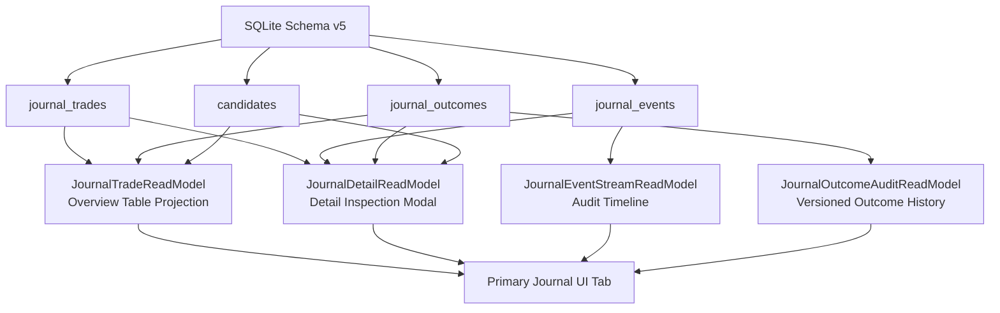
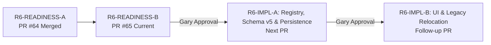

# MVP-ARCH-001-R6-READINESS-B: Journal UI, Integration, and Rollout Readiness

**Task ID:** `MVP-ARCH-001-R6-READINESS-B`
**Classification:** `research-design-governance-only`
**Repository base:** `main` @ `ade64f0da9463495cf36f758ec4b219ab6d85318`
**Production trading behavior changed:** No
**Schema changed:** No — the runtime schema remains **v4** in this PR
**R6 implementation authorized:** No
**Strategy promotion authorized:** No — `APPROVED_ACTIONABLE_STRATEGIES == ()` is unchanged
**R7 / R8 authorized:** No
**LONG-002C:** Remains paused; not resumed by this document

---

> ### NORMATIVE DATA CONTRACT REFERENCE
>
> The authoritative, normative data, lifecycle, execution, and persistence specification for the future TradeX executable-strategy Journal is:
>
> [`docs/product/MVP-ARCH-001-R6-DATA-CONTRACT.md`](MVP-ARCH-001-R6-DATA-CONTRACT.md)
> *(Merged into `main` via PR #64 / commit `ade64f0da9463495cf36f758ec4b219ab6d85318`)*
>
> **Precedence Rule:** This document (`MVP-ARCH-001-R6-READINESS-B.md`) is strictly complementary and **MUST NOT** override, redefine, or establish competing definitions for the normative contract. If this document and `docs/product/MVP-ARCH-001-R6-DATA-CONTRACT.md` ever disagree on data shape, state semantics, strategy authorization, persistence DDL, fills, quantities, costs, returns, outcomes, provenance, idempotency, or migrations, the merged **`docs/product/MVP-ARCH-001-R6-DATA-CONTRACT.md` controls**.

---

## Executive Summary & Scope

This document defines the complementary **UI, presentation, read-model projection, integration, and rollout readiness** specification for **TradeX MVP-ARCH-001 Step 6** ("Journal/outcome replacement").

Where `MVP-ARCH-001-R6-DATA-CONTRACT.md` (R6-READINESS-A) governs the domain models, SQLite schema DDL, event logging, strategy authorization, return mathematics, and lifecycle state machine, this document (R6-READINESS-B) defines:

1. **Primary Journal User Interface:** Visual design, table layouts, lifecycle state badges, execution provenance badges, outcome confidence badges, and detail inspection surfaces.
2. **Empty, Deprecated, and Error UX:** Truthful zero-strategy empty state, visual presentation of historical trades from deprecated strategies, and error presentation.
3. **Legacy Telemetry Relocation:** Moving the existing `Signal Journal` surface under **Research Lab** as `"Legacy Scanner Telemetry"` with complete historical data preservation and prominent disclaimers.
4. **UI Read-Model Mapping:** How the UI consumes the normative `JournalTrade`, `JournalEvent`, and `JournalOutcome` persistence models without requiring separate or competing database structures.
5. **Integration Boundaries:** Read-only linkage to immutable `CandidateSnapshot` dossiers, integration with the neutral strategy registry, and evidence notice registration.
6. **Implementation Sequencing & Risk Packaging:** Recommended implementation slicing (R6-IMPL-A and R6-IMPL-B) and forward-compatible rollback behavior.

---

## A. Current-State Evidence [FACT]

This section documents the verified current implementation as of commit `ade64f0`.

### A.1 Current Navigation Structure

The TradeX dashboard currently exposes an 8-surface navigation header (`tradex/ui/dashboard.py`):

$$\text{Today} \mid \text{Scanner} \mid \text{Confluence} \mid \text{Pre-Market} \mid \text{Signal Journal} \mid \text{Research Lab} \mid \text{Settings} \mid \text{Help}$$

### A.2 Current Signal Journal Behavior

**Source:** `tradex/ui/tabs/signal_journal.py`

Current Tab 5 behavior:
1. Renders an evidence notice (`render_evidence_notice("signal_journal")`) stating that contents represent legacy heuristic scanner telemetry.
2. Provides a manual "Refresh Outcomes Now" button that calls `run_outcome_pass(verbose=False, provider=provider, settings=settings)` to evaluate unresolved scanner signals whose forward price window has closed.
3. Fetches resolved signals via `store.get_signal_journal(timeframe=..., settings=settings)`.
4. Computes descriptive summary metrics:
   - **Total Signals:** `len(journal)`
   - **Win Rate:** `(len(wins) / len(journal)) * 100` where `outcome_pct > 0`
   - **Avg Win / Avg Loss:** Arithmetic means of positive and negative `outcome_pct`
   - **Legacy Expectancy:** `(win_rate * avg_win) + (loss_rate * avg_loss)` — descriptive arithmetic over unvalidated forward closes, not modeling trade execution, stops, targets, slippage, or commissions.
5. Renders a Plotly histogram of `outcome_pct` distributions and score-bucket performance tables.

### A.3 Schema Version and Source Tables

**Current Schema Version:** `_SCHEMA_VERSION = 4` (in `tradex/tracker/store.py`)

- **Legacy Telemetry Tables:** `signal_history`, `scan_runs`, `scan_sessions`, `scan_observations`
- **Candidate Domain Tables:** `candidates`, `candidate_evaluations`, `candidate_evidence`, `candidate_reasons`, `candidate_missing_data`

### A.4 Strategy Authorization State

**Source:** `tradex/alerts/eligibility.py`

```python
APPROVED_ACTIONABLE_STRATEGIES: tuple[ApprovedActionableStrategy, ...] = ()
```

The registry is currently an empty tuple. All strategy authorization checks fail closed.

---

## B. Primary Journal UI Contract [PROPOSED]

### B.1 Surface Identity and Hierarchy

- **Top-Level Navigation:** Tab 5 is renamed from `"Signal Journal"` to `"Journal"`.
- **Page Header:** `"Journal"`
- **Subheader / Descriptor:** `"Executable Strategy Journal"`
- **Evidence Notice:** Rendered via `render_evidence_notice("journal")` confirming that records represent production-governed executable strategy trade plans and realized execution history.

### B.2 Primary Overview Table

The primary Journal surface displays a unified overview of all executable trade records (`journal_trades`), sorted by `plan_created_at DESC`:

| Column Header | Source Field / Projection | Presentation / Formatting |
|---|---|---|
| **Symbol** | `candidates.symbol` (via `candidate_id` FK) | Ticker string in bold monospace (e.g., `AAPL`) |
| **State** | `journal_trades.state` | Visual status badge (see §B.3) |
| **Strategy** | `strategy_id` + `strategy_version` | Monospace string (e.g., `long_momentum v1.0`) |
| **Side** | `journal_trades.side` | `LONG` (neutral badge; long-only in R6) |
| **Planned Entry** | `journal_trades.planned_entry` | Currency `$XX.XX` |
| **Qty** | `journal_trades.quantity` | Numeric integer/float (e.g., `100`); `—` when `planned` |
| **Fill Price** | `journal_trades.fill_price` | Currency `$XX.XX`; `—` when unfilled |
| **Stop** | `journal_trades.stop_price` | Currency `$XX.XX`; `—` if none configured |
| **Target** | `journal_trades.target_price` | Currency `$XX.XX`; `—` if none configured |
| **Exit Price** | `journal_trades.exit_price` | Currency `$XX.XX`; `—` when open/unfilled |
| **Exit Reason** | `journal_trades.exit_reason` | Human-readable tag (e.g., `Stop`, `Target`, `Expiration`, `Invalidation`, `Discretionary`); `—` when open |
| **Gross Return** | `journal_outcomes.gross_return_pct` | Color-coded percentage (e.g., `+8.95%` in green, `-2.10%` in red); `—` when open |
| **Net Return** | `journal_outcomes.net_return_pct` | Color-coded percentage (e.g., `+8.85%`); `Unknown` if `costs` is `NULL`; `—` when open |
| **Confidence** | `journal_outcomes.outcome_confidence` | Confidence badge (see §B.5) |
| **Provenance** | `journal_trades.fill_provenance` / `exit_provenance` | Execution provenance badge (see §B.4) |
| **Decision Time** | `journal_trades.decision_timestamp` | Formatted ET: `Aug 28, 2026 09:35 AM ET` |

### B.3 Lifecycle State Badges

The UI visually represents the 6 normative lifecycle states defined in `MVP-ARCH-001-R6-DATA-CONTRACT.md` (§D.1):

| State | Badge Text | Badge Visual Style | Description |
|---|---|---|---|
| `planned` | `Planned` | Slate / Neutral Gray | Trade plan recorded; awaiting entry execution |
| `open` | `Open` | Blue / Solid Accent | Entry filled; position is currently active |
| `closed` | `Closed` | Green (Gain) / Red (Loss) / Slate (Flat) | Position exited; outcome calculated and locked |
| `cancelled` | `Cancelled` | Gray Outline / Muted | Plan withdrawn prior to fill with recorded reason |
| `expired` | `Expired` | Gray Outline / Muted | Plan reached expiration timestamp without fill |
| `invalidated` | `Invalidated` | Amber / Warning Outline | Plan invalidation condition triggered before fill |

### B.4 Execution Provenance Presentation

The UI clearly distinguishes execution sources according to the normative contract (§F):

| Provenance Key | Badge Label | Badge Style | Presentation Context |
|---|---|---|---|
| `manual` | `Reported Actual` | Slate / Neutral Badge | Trader-reported manual fill/exit observation |
| `simulated` | `Simulated` | Purple / Violet Badge | Derived from market data via documented simulation rule |
| `broker_confirmed` | `Broker Confirmed` | Green / Verified Badge | Confirmed via live broker integration (unavailable in R6 v1) |

- **Simulated Detail Tooltip / Card:** When provenance is `simulated`, the UI displays the simulation rule and raw market-data provider captured in event provenance (e.g., `Simulated: next_open_rule [schwab]`).
- **No Metric Mixing:** Aggregate UI summary cards must **never combine** simulated and actual reported executions into a single aggregate metric.

### B.5 Outcome Confidence Presentation

The UI displays the 3 normative outcome-confidence levels defined in `MVP-ARCH-001-R6-DATA-CONTRACT.md` (§G):

| Confidence Level | Badge Label | Badge Style | Semantic Meaning |
|---|---|---|---|
| `confirmed` | `Confirmed` | Green Badge | Verified broker-confirmed entry and exit fills |
| `provisional` | `Provisional` | Amber / Yellow Badge | Valid manual or simulated fills with complete outcome context |
| `unknown` | `Unknown` | Gray / Slate Badge | Missing provenance or non-closed trade |

### B.6 Cost & Net Return Presentation

- **When `costs` is known (non-NULL):** Displays `Net Return (%)` calculated per the normative formula:
  $$\text{net\_return\_pct} = \left(\frac{\text{exit\_price} - \text{fill\_price} - \frac{\text{costs}}{\text{quantity}}}{\text{fill\_price}}\right) \times 100$$
  Detail card displays explicit total trade costs in USD (e.g., `Fees: $10.00`).
- **When `costs` is unknown (`NULL`):**
  - Displays `Gross Return (%)` computed directly from fill and exit prices.
  - Displays `Net Return: Unknown (Costs unavailable)` or `—`.
  - **Never** defaults `costs` to 0.0 or displays gross return as net return.

### B.7 Strategy Drawdown Presentation

- As specified in `MVP-ARCH-001-R6-DATA-CONTRACT.md` (§G), `strategy_drawdown` fails closed to `NULL`/unknown in R6 v1 because no capital, position-sizing, or portfolio aggregation model is approved.
- **UI Requirement:** The UI renders `Strategy Drawdown: Unknown` or `Not available`. It must **never render 0** or fabricate synthetic drawdown metrics.

### B.8 Historical & Deprecated Strategy Handling

- **Immutable History:** Historical Journal records for strategies that were subsequently deauthorized, deprecated, or removed from `APPROVED_PRODUCTION_STRATEGIES` remain **100% visible and searchable** in the Journal.
- **Visual Decoration:** Deauthorized strategy records display a secondary visual tag: `[Deprecated Strategy]` or `[Not Currently Authorized]`.
- **Detail Drill-Down:** Clicking any historical entry allows complete inspection of its original decision context, immutable plan, execution history, and computed outcomes.

### B.9 Trade Detail Drill-Down Modal / Card

Clicking a row in the Journal table opens an expandable detail view providing:

1. **Decision Context & Candidate Linkage:**
   - Link to upstream immutable `CandidateSnapshot` (`candidate_id`).
   - Snapshot decision timestamp and point-in-time market evidence.
2. **Immutable Trade Plan:**
   - Planned entry, stop, target, expiration, and invalidation rule JSON.
3. **Execution Audit Timeline:**
   - Chronological event stream from `journal_events` showing `seq`, `event_type`, `event_timestamp`, `recorded_at`, and raw `payload_json`.
   - Execution provenance detail (observer, simulation rule, market-data provider).
4. **Outcome Computation History:**
   - Current outcome version with `computation_version`, `computed_at`, `source_event_seq`, and `inputs_hash`.
   - Option to inspect prior outcome computations if recomputed.
5. **Terminal Reasons:**
   - For `cancelled` / `invalidated` records: displays full `terminal_reason`.

### B.10 Strict Exclusion of Legacy Telemetry Scores

The Journal UI strictly excludes:
- 0–100 heuristic scanner scores (intraday/short/long momentum scores)
- Coil strength numbers
- Confluence ranks
- Unvalidated telemetry rankings

The Journal is an execution audit log, not a scanner surface.

---

## C. Zero-Strategy Empty State UX [PROPOSED]

When no strategy in `APPROVED_PRODUCTION_STRATEGIES` holds the `"journal_execution"` capability (the initial state upon R6 introduction):

1. **Primary Journal Table State:** Renders zero rows.
2. **Empty State Panel:** Displays a prominent, truthful explanation:

> **Executable Strategy Journal**
>
> No production-approved executable strategy with Journal execution capability is currently active. TradeX has no executable strategy Journal records.
>
> Legacy scanner outcomes remain available as descriptive telemetry in the Legacy Scanner Telemetry section (Research Lab) and are not actual trade results.

3. **No Call-to-Action:** The UI renders no buttons or triggers implying that executable trade plans can be generated from unapproved scanners or heuristic signals.

---

## D. Legacy Scanner Telemetry Disposition [PROPOSED]

### D.1 Relocation to Research Lab

The legacy scanner telemetry interface (`tradex/ui/tabs/signal_journal.py`) is relocated under the **Research Lab** tab in a dedicated section titled **"Legacy Scanner Telemetry"**:

1. **Navigation Consolidation:** Tab 5 becomes the primary `"Journal"`. Legacy scanner telemetry moves to Research Lab as secondary historical context.
2. **Complete Data Preservation:** All rows in legacy tables (`signal_history`, `scan_runs`, `scan_sessions`, `scan_observations`) remain 100% intact and queryable in Schema v5.
3. **Outcome Refresh Operation:** The manual "Refresh Outcomes Now" button remains operational within the Legacy Scanner Telemetry section in Research Lab.
4. **Descriptive Disclaimers:** Legacy metrics (Legacy Win Rate, Legacy Expectancy) are prominently labelled with disclaimers:
   > *"Legacy Expectancy is descriptive arithmetic over unvalidated generic forward closes. It does not model executable strategy performance, fills, stops, slippage, or transaction costs."*
5. **Zero Backfill Boundary:** Legacy `signal_history` rows are **never** backfilled, converted, or migrated into `journal_trades`.

---

## E. UI Read-Model Mapping [PROPOSED]

The UI consumes data from the normative persistence tables (`journal_trades`, `journal_events`, `journal_outcomes`) via a dedicated read-only query module (`tradex/journal/queries.py`):



### E.1 Read-Model Projections

1. **`JournalTradeReadModel` (Overview Projection):**
   - Combines `journal_trades` row with the latest `journal_outcomes` record (by highest `computed_at` / `source_event_seq`) and `candidates.symbol`.
   - Exposes formatted display strings for table rendering (e.g., localized ET timestamps, formatted percentages, status badges).
2. **`JournalDetailReadModel` (Detail View Projection):**
   - Full projection containing trade headers, immutable plan, execution details, candidate snapshot context, and links to event history.
3. **`JournalEventStreamReadModel` (Event Log Projection):**
   - Ordered list of `JournalEvent` objects for a given `journal_id` (`ORDER BY seq ASC`).
4. **`JournalOutcomeAuditReadModel` (Outcome History Projection):**
   - Chronological list of all `JournalOutcome` records for a trade (`ORDER BY computed_at DESC`), exposing `inputs_hash`, `computation_version`, and computed returns.

### E.2 Read-Model Query Interfaces

```python
def get_journal_overview(
    *,
    state: str | None = None,
    strategy_id: str | None = None,
    symbol: str | None = None,
    limit: int = 100,
    offset: int = 0,
    db_path: str | Path | None = None,
    settings: TradeXSettings | None = None,
) -> list[JournalTradeReadModel]:
    """Queries journal overview projections sorted by plan_created_at DESC."""

def get_journal_detail(
    journal_id: str,
    *,
    db_path: str | Path | None = None,
    settings: TradeXSettings | None = None,
) -> JournalDetailReadModel | None:
    """Queries full trade detail projection with candidate context and latest outcome."""

def get_journal_events_timeline(
    journal_id: str,
    *,
    db_path: str | Path | None = None,
    settings: TradeXSettings | None = None,
) -> list[JournalEventStreamReadModel]:
    """Queries append-only event stream ordered by sequence number."""
```

---

## F. Integration Boundaries & Governance

1. **Candidate Snapshot Boundary:**
   - The Journal references `candidates.candidate_id` via a foreign key constraint.
   - Journal operations are strictly read-only with respect to candidate tables; no Journal write may insert, update, or delete candidate dossiers.
2. **Strategy Registry Boundary:**
   - The Journal UI inspects `APPROVED_PRODUCTION_STRATEGIES` in `tradex/strategies/registry.py` to identify whether a trade's strategy currently holds the `"journal_execution"` capability.
   - Registry lookups are purely in-memory/code-defined; the registry is never modified via UI or database queries.
3. **Evidence Notices:**
   - Registers `"journal"` key in `tradex/ui/evidence.py` to render standard TradeX evidence cards.
4. **Settings & Isolation:**
   - All persistence queries and UI operations accept explicit `TradeXSettings` and respect `settings.db_path`.

---

## G. Implementation Sequencing & Risk Packaging [PROPOSED]

To isolate schema/persistence risk from UI/navigation refactoring, the implementation of Step 6 should be split into bounded, sequentially approved PRs:



### Phase 1: MVP-ARCH-001-R6-IMPL-A (Data, Persistence, and Service Layer)
- **Scope:**
  - Neutral production strategy registry (`tradex/strategies/registry.py`) with `"journal_execution"` and `"automatic_alerts"` capability grants.
  - Alert eligibility adapter consuming `"automatic_alerts"` capability while preserving empty fail-closed behavior.
  - Additive Schema v5 migration (`_migrate_v4_to_v5`) creating `journal_trades`, `journal_events`, and `journal_outcomes`.
  - Domain models (`tradex/journal/models.py`), persistence primitives (`tradex/journal/store.py`), service APIs (`tradex/journal/service.py`), and outcome calculation (`tradex/journal/outcomes.py`).
  - Unit and store test suites.
- **Boundaries:** Zero UI modifications, zero strategy promotions, zero alert threshold changes.

### Phase 2: MVP-ARCH-001-R6-IMPL-B (Primary UI and Legacy Telemetry Relocation)
- **Scope:**
  - Read-only query layer (`tradex/journal/queries.py`).
  - Primary Journal tab renderer (`tradex/ui/tabs/journal.py`).
  - Relocation of legacy signal journal to Research Lab (`tradex/ui/tabs/research_lab.py`).
  - Dashboard navigation updates (`tradex/ui/dashboard.py`).
  - Evidence notice registration (`tradex/ui/evidence.py`).
  - UI regression and integration test suites.
- **Boundaries:** Dependent on merged R6-IMPL-A; zero new schema changes, zero strategy promotions.

### Forward-Compatible Rollback Behavior
- If R6-IMPL-B requires rollback:
  1. Rollback code accepts `PRAGMA user_version == 5`.
  2. The `journal_trades`, `journal_events`, and `journal_outcomes` tables remain dormant and untouched in SQLite.
  3. Dashboard navigation restores Tab 5 as `"Signal Journal"`.
  4. All legacy tables continue operating normally without schema downgrade surgery.

---

## H. Acceptance Criteria (UI, Read Models, and Integration) [PROPOSED]

The future implementation of R6-IMPL-B must satisfy the following acceptance criteria:

1. **Tab Identity:** Tab 5 renders as `"Journal"` with subheader `"Executable Strategy Journal"`.
2. **Zero-Strategy Empty State:** When `APPROVED_PRODUCTION_STRATEGIES` has no strategy with `"journal_execution"`, the Journal tab renders the truthful empty state message without action buttons.
3. **Overview Table Projection:** Correctly displays symbols, 6 normative lifecycle state badges, strategies, planned entries, quantities, realized fills, stops, targets, exit prices, exit reasons, returns, confidence badges, and provenance badges.
4. **Lifecycle Badges:** All 6 normative states (`planned`, `open`, `closed`, `cancelled`, `expired`, `invalidated`) render distinct, correct visual badges.
5. **Execution Provenance:** `manual`, `simulated`, and `broker_confirmed` render distinct badges; `simulated` displays rule ID and provider tooltip.
6. **Outcome Confidence:** `confirmed`, `provisional`, and `unknown` render distinct badges derived deterministically from the normative contract.
7. **Cost & Net Return:** Displays formatted `net_return_pct` when `costs` is known; displays `Gross Return` and `Net Return: Unknown` when `costs` is `NULL`.
8. **Strategy Drawdown:** Renders `"Unknown"` / `"Not available"`; never renders 0.
9. **Deprecated Strategy Display:** Historical trades for deauthorized strategies remain visible with `[Deprecated Strategy]` tag.
10. **Detail View Drill-Down:** Expands to show candidate snapshot link, immutable plan, append-only event stream, and versioned outcome audit history.
11. **Legacy Telemetry Relocation:** Existing Signal Journal telemetry is accessible under Research Lab as `"Legacy Scanner Telemetry"` with operational outcome refresh button and descriptive disclaimers.
12. **Data Preservation:** Zero legacy rows in `signal_history` or candidate tables are modified or backfilled into `journal_trades`.
13. **Rollback Compatibility:** Rollback build accepts Schema v5 and keeps Journal tables dormant.
14. **Test Suite:** Deterministic, credential-free UI and query test suite passes completely.

---

*This document is a versioned readiness and UI/integration specification. It does not implement any schema, migration, model, service, UI, alert, provider, or strategy change, and it does not authorize R6 implementation, R7, R8, LONG-002C, or any strategy promotion.*
