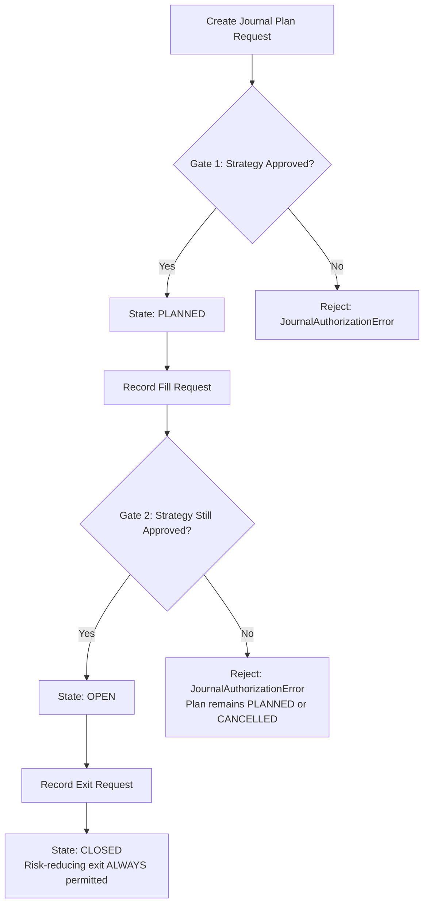
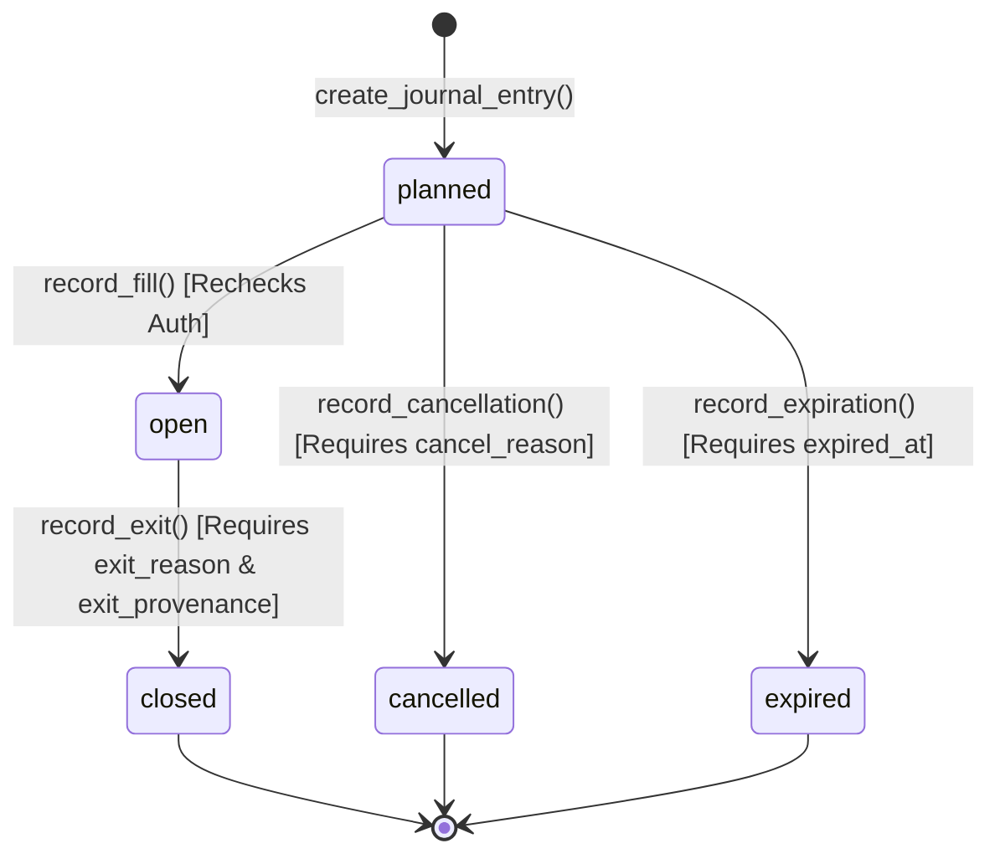
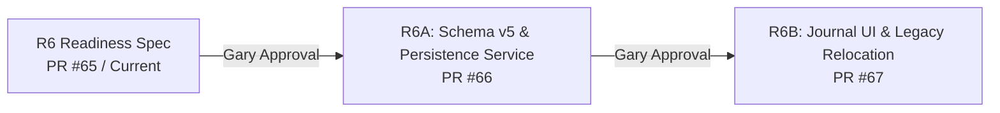

# MVP-ARCH-001-R6-READINESS: Executable Journal Contract and Implementation Specification

**Task ID:** `MVP-ARCH-001-R6-READINESS`
**Classification:** Design, data contract, and governance readiness specification only
**Production trading behavior changed:** No
**Schema changed:** No (remains Schema v4 in this PR)
**R6 implementation authorized:** No
**Strategy promoted:** No
**R7/R8 authorized:** No
**LONG-002C resumed:** No

**Base SHA:** `cba9ffc76d8aa1feadc47fb3743fb8a3835acbbc` (`origin/main`, containing merged R5C via PR #63)
**Prerequisites:** Step 5 complete (R5A PR #61, R5B PR #62, R5C PR #63 — all merged to `main`)

---

## Executive Summary & Scope

This document defines the implementation-ready executable Journal contract for **TradeX MVP-ARCH-001 Step 6** (`Journal/outcome replacement`). It provides an unambiguous specification of data models, database schema, state machine lifecycles, service interfaces, return mathematics, provenance boundaries, UI presentations, and governance rules.

### Explicit R6 Scope Boundaries

1. **Long-Only Equity Swing Scope:** R6 strictly supports long-only executable equity strategies. Short-side execution semantics, inverse instruments, and derivative contracts are **out of scope** for R6 and require separate research protocol approval and architecture amendment.
2. **Single-Fill Execution Model:** R6 strictly models single-lot execution:
   $$\text{1 CandidateSnapshot} + \text{1 Strategy/Version} = \text{1 Immutable Plan} \le \text{1 Entry Fill} \le \text{1 Exit Fill}$$
   Partial fills, multi-leg scaling, scale-in, scale-out, pyramiding, and position re-entries are **explicitly out of scope** for R6.
3. **Fail-Closed Strategy Authorization:** No Journal plan may be created, and no planned record may be filled, without verifying that the strategy is currently registered in `APPROVED_ACTIONABLE_STRATEGIES` with `evidence_state == "production_approved"`.
4. **No Automated Brokerage Execution:** TradeX is not an automated brokerage execution system. R6 defines execution recording and provenance tracking (`manual_reported_actual`, `simulated`, `broker_confirmed`); `broker_confirmed` fails closed until real brokerage integration is authorized.
5. **Readiness Only:** This specification does not authorize code implementation, schema migration, or strategy promotion.

---

## A. Current-State Evidence

This section documents the verified current implementation as of commit `cba9ffc`.

### A.1 Current Journal UI Behavior

The Signal Journal is currently rendered as Tab 5 in the transitional 8-surface navigation:

$$\text{Today} \mid \text{Scanner} \mid \text{Confluence} \mid \text{Pre-Market} \mid \text{Signal Journal} \mid \text{Research Lab} \mid \text{Settings} \mid \text{Help}$$

**Source:** `tradex/ui/tabs/signal_journal.py`

Current Tab 5 behavior:
1. Renders an evidence notice (`render_evidence_notice("signal_journal")`) stating that contents represent legacy heuristic scanner telemetry.
2. Provides a manual "Refresh Outcomes Now" button that calls `run_outcome_pass(verbose=False, provider=provider, settings=settings)` to evaluate unresolved scanner signals whose forward price window has closed.
3. Fetches resolved signals via `store.get_signal_journal(timeframe=..., settings=settings)`.
4. Computes descriptive summary metrics:
   - **Total Signals:** `len(journal)`
   - **Win Rate:** `(len(wins) / len(journal)) * 100` where `outcome_pct > 0`
   - **Avg Win / Avg Loss:** Arithmetic means of positive and negative `outcome_pct`
   - **Legacy Expectancy:** `(win_rate * avg_win) + (loss_rate * avg_loss)` — descriptive arithmetic over generic forward closes, not modeling trade execution, stops, targets, slippage, or commissions.
5. Highlights provider provenance mismatches when `signal_provider != outcome_provider`.
6. Renders a Plotly histogram of `outcome_pct` distributions and score-bucket performance tables.

### A.2 Source Tables (Schema v4)

**Current Schema Version:** `_SCHEMA_VERSION = 4` (in `tradex/tracker/store.py`)

#### Legacy Scanner and Telemetry Tables

| Table | Primary Key | Key Columns | Role |
|---|---|---|---|
| `signal_history` | `id` (INTEGER AUTOINCREMENT) | `ticker`, `timeframe`, `scan_time`, `score`, `last_close`, `volume_ratio`, `rsi`, `reasons`, `provider`, `outcome_close`, `outcome_pct`, `outcome_at`, `outcome_provider`, `scan_session_id`, `trading_date` | Legacy qualifying scanner signals and generic forward close returns |
| `scan_runs` | `id` (INTEGER AUTOINCREMENT) | `run_time`, `timeframe`, `tickers_n`, `hits_n`, `provider`, `session_id`, `status`, `requested_provider`, `actual_provider`, `counts_complete`, `source` | Audit run records |
| `scan_sessions` | `session_id` (TEXT) | `scan_time`, `trading_date`, `timeframe`, `requested_provider`, `actual_provider`, `fallback_used`, `providers_attempted`, `status`, `source`, observation counts | Canonical session provenance |
| `scan_observations` | `(session_id, ticker)` | `session_id`, `ticker`, `status`, `score`, `indicators`, `provider`, `error_info` | Per-ticker observation audit |

#### Schema v4 Candidate Domain Tables (R5A/R5B)

| Table | Primary Key | Foreign Keys | Role |
|---|---|---|---|
| `candidates` | `candidate_id` (TEXT) | None | Immutable `CandidateSnapshot` header |
| `candidate_evaluations` | `evaluation_id` (TEXT) | `candidate_id` REFERENCES `candidates(candidate_id)` ON DELETE CASCADE | Versioned evaluator envelopes |
| `candidate_evidence` | `evidence_id` (TEXT) | `candidate_id` REFERENCES `candidates(candidate_id)` ON DELETE CASCADE | Structured PIT observation provenance |
| `candidate_reasons` | `reason_id` (TEXT) | `candidate_id` REFERENCES `candidates`, `evaluation_id` REFERENCES `candidate_evaluations` | Explainability reason records |
| `candidate_missing_data` | `record_id` (TEXT) | `candidate_id` REFERENCES `candidates`, `evaluation_id` REFERENCES `candidate_evaluations` | Typed missing-data taxonomy records |

### A.3 Current Outcome Calculation

**Source:** `tradex/tracker/outcome_tracker.py`

Forward horizon windows (`OUTCOME_WINDOWS`):
- `intraday`: 1 trading session forward
- `short`: 3 trading sessions forward
- `long`: 5 trading sessions forward

Calculation:
1. `run_outcome_pass` fetches pending rows from `signal_history` where `outcome_close IS NULL AND last_close IS NOT NULL`.
2. For each signal whose forward trading-session window has closed, fetches `outcome_close` from historical daily OHLCV bars.
3. Computes percentage change:
   $$\text{outcome\_pct} = \left(\frac{\text{outcome\_close} - \text{last\_close}}{\text{last\_close}}\right) \times 100$$
4. Persists `outcome_close`, `outcome_pct`, `outcome_at`, `outcome_provider` via `mark_outcome_by_id`.

**Fundamental Limitations:**
- Reference price is signal observation close, not an executable entry fill.
- Exit price is an arbitrary $N$-session later close, not a strategy-defined stop, target, or invalidation.
- Does not track order fills, slippage, commissions, or intra-holding drawdown.
- Cannot validate whether a trading strategy has an edge.

### A.4 CandidateSnapshot Deterministic Identifiers

**Source:** `tradex/candidates/models.py`, `tradex/candidates/aggregator.py`

All candidate domain identifiers are deterministic, content-derived SHA-256 hashes:
- `candidate_id`: `cand_<sha256(session_id + "\x1f" + symbol)[:24]>`
- `evaluation_id`: `eval_<sha256(candidate_id + "\x1f" + evaluator_id + "\x1f" + evaluator_version)[:24]>`
- `evidence_id`: `evid_<sha256(candidate_id + "\x1f" + evidence_type)[:24]>`
- `reason_id`: `rsn_<sha256(evaluation_id + "\x1f" + dimension + "\x1f" + reason_code)[:24]>`
- `record_id` (missing data): `miss_<sha256(candidate_id + "\x1f" + input_name)[:24]>`

The proposed `journal_entries` table links directly to `candidates.candidate_id` as a foreign key.

### A.5 Strategy Authorization Registry

**Source:** `tradex/alerts/eligibility.py`

```python
APPROVED_ACTIONABLE_STRATEGIES: tuple[ApprovedActionableStrategy, ...] = ()
```

The registry is currently an empty tuple. All strategy authorization checks fail closed.

### A.6 Application Startup & Migration Failure Semantics

**Source:** `tradex/tracker/store.py` (`init()` and connection managers)

- Database initialization runs in `store.init(db_path=...)`.
- If a schema migration encounters an error, the SQLite transaction is rolled back, `user_version` remains unchanged, and `StoreError` is raised.
- `store.init()` failure halts application startup. TradeX does **not** support partial runtime operation when database initialization fails.

---

## B. Fail-Closed Behavior with No Approved Strategy

### B.1 Empty Registry Invariants

When `APPROVED_ACTIONABLE_STRATEGIES` is empty (the current state):

1. **No Journal Plans Created:** No executable Journal trade plan may be created from scanner signals, shadow candidate evaluations, heuristic scores, or research pipelines.
2. **No Fills Recorded:** No transition to `open` may occur.
3. **No Synthetic Backfilling:** Legacy `signal_history` rows must never be backfilled, converted, or migrated into `journal_entries`.
4. **Empty Primary Journal Table:** The `journal_entries` table exists in Schema v5 but contains zero rows.

### B.2 Primary Journal Empty State Message

When the primary Journal tab renders with zero approved strategies:

> **Executable Strategy Journal**
>
> No production-approved executable strategy is currently active. TradeX has no executable strategy Journal records.
>
> Legacy scanner outcomes remain available as descriptive telemetry in the Legacy Scanner Telemetry section (Research Lab) and are not actual trade results.

---

## C. Strategy Authorization & Deauthorization Boundary

### C.1 Strategy Identity

A strategy is identified by the composite tuple:
$$(\text{strategy\_id}, \text{strategy\_version})$$
- `strategy_id`: Non-empty alphanumeric/underscore string (e.g., `"swing_breakout_long"`).
- `strategy_version`: Non-empty semantic version string (e.g., `"1.0.0"`).

### C.2 Two-Gate Exposure Authorization Model

To prevent unauthorized risk while preserving risk-reducing management of existing positions:



1. **Gate 1 (Plan Creation):** `create_journal_entry` checks that `(strategy_id, strategy_version)` is in `APPROVED_ACTIONABLE_STRATEGIES` with `evidence_state == "production_approved"`. If not, raises `JournalAuthorizationError`.
2. **Gate 2 (Exposure Creation / Fill):** `record_fill` **rechecks** that `(strategy_id, strategy_version)` is in `APPROVED_ACTIONABLE_STRATEGIES`. If the strategy was deprecated or removed between plan creation and fill attempt:
   - `record_fill` is **rejected** with `JournalAuthorizationError`.
   - The record remains in `planned` state and may subsequently transition to `cancelled` or `expired`.
3. **Risk-Reducing Exit Gate (Open $\rightarrow$ Closed):** Deauthorization or deprecation of a strategy **never blocks** closing an already open position. `record_exit` transitions `open -> closed` regardless of whether the strategy is currently approved. The exit record captures `exit_reason = "strategy_deprecated"` if closed due to deauthorization.

### C.3 Historical Queries Are Not Authorization-Gated

- `get_journal_entries()` and `get_journal_entry()` query persisted database records without filtering on current strategy authorization status.
- Persisted records for deprecated or historical strategies remain 100% visible and auditable forever.
- The UI displays historical records with their persisted `strategy_id` and `strategy_version`, with an optional visual decoration indicating historical/deprecated status.

---

## D. Journal Identity and Candidate Linkage

### D.1 Primary Identifier

```sql
journal_id TEXT PRIMARY KEY  -- Format: jrnl_<uuid4_hex> (e.g., jrnl_3f7b2c9a1d4e...)
```

UUID-derived identifiers ensure global uniqueness across distributed processes and prevent implicit ordering assumptions.

### D.2 CandidateSnapshot Foreign Key

```sql
candidate_id TEXT NOT NULL REFERENCES candidates(candidate_id) ON DELETE RESTRICT
```

Every Journal record must reference an existing, immutable `CandidateSnapshot`. This anchors the trade plan to the exact point-in-time evidence, evaluator envelope, and missing-data records that existed when the candidate was observed.

### D.3 Timestamp Semantics: Plan vs. Decision

- `candidates.decision_timestamp`: UTC timestamp when the market observation was captured.
- `journal_entries.plan_created_at`: UTC timestamp when the executable trade plan was generated.
- Invariant: `plan_created_at >= candidates.decision_timestamp`.

### D.4 Uniqueness and Single-Fill Invariant

```sql
UNIQUE(candidate_id, strategy_id, strategy_version)
```

**Single-Fill Rule:** For a given candidate observation and strategy version, exactly one plan and at most one execution lifecycle may exist.

**Idempotency & Conflict Handling:**
- **Exact Replay:** Calling `create_journal_entry` with matching `candidate_id`, `strategy_id`, `strategy_version`, and matching material planned fields returns the existing `JournalEntry` without error.
- **Material Divergence:** Calling `create_journal_entry` with matching `(candidate_id, strategy_id, strategy_version)` but conflicting planned prices or parameters raises `JournalConflictError`.
- **Unsupported Multiple Fills:** Attempting to record a second fill on the same candidate/strategy raises `JournalUnsupportedError`.

---

## E. Lifecycle & State Machine

### E.1 State Definitions

| State | Type | Description |
|---|---|---|
| `planned` | Initial | Trade plan created with defined entry, stop, target, and expiration. No fill has occurred. |
| `open` | Active | Entry fill recorded. Position is active in the market. |
| `closed` | Terminal | Position has been completely exited. Realized return and costs are locked. |
| `cancelled` | Terminal | Plan was cancelled **before any fill occurred**. |
| `expired` | Terminal | Plan reached its expiration time **without receiving a fill**. |

### E.2 State Transition Matrix



| Source State | Target State | Triggering API | Required Input Fields | Forbidden Regressions / Notes |
|---|---|---|---|---|
| `[*]` | `planned` | `create_journal_entry` | `candidate_id`, `strategy_id`, `strategy_version`, `symbol`, `planned_entry`, `plan_created_at` | Strategy must be production-approved. Fill/exit fields must be NULL. |
| `planned` | `open` | `record_fill` | `fill_price`, `fill_timestamp`, `fill_provenance` | Strategy must STILL be production-approved. Planned parameters become permanently locked. |
| `planned` | `cancelled` | `record_cancellation` | `cancel_reason`, `cancelled_at` | Fill fields must remain NULL. Terminal state. |
| `planned` | `expired` | `record_expiration` | `expired_at` | Fill fields must remain NULL. Terminal state. |
| `open` | `closed` | `record_exit` | `exit_price`, `exit_timestamp`, `exit_reason`, `exit_provenance` | Risk-reducing; allowed even if strategy is deprecated. Terminal state. |

### E.3 Strictly Forbidden Transitions

1. **`open -> cancelled` (FORBIDDEN):** Once an entry fill exists, an actual or simulated market position existed. Terminating an open position (whether due to manual intervention, invalidation rule, or strategy deprecation) must always transition `open -> closed` with the appropriate `exit_reason`.
2. **`planned -> closed` (FORBIDDEN):** A trade cannot close without an entry fill.
3. **`closed -> *`, `cancelled -> *`, `expired -> *` (FORBIDDEN):** Terminal states cannot transition to any other state.
4. **`open -> planned`, `open -> expired` (FORBIDDEN):** Fills cannot be reversed; open positions close, they do not expire.

---

## F. Planned Trade Contract (Long-Only)

### F.1 Field Specifications

| Field | Type | Nullable | Validation Rules | Immutability |
|---|---|---|---|---|
| `planned_entry` | `REAL` | No | Must be positive (`> 0.0`). For next-open strategy, estimated open; for limit order, limit price. | Immutable once created. |
| `stop_price` | `REAL` | Yes | If provided, must satisfy: `0.0 < stop_price < planned_entry`. | Immutable once created. |
| `target_price` | `REAL` | Yes | If provided, must satisfy: `target_price > planned_entry`. | Immutable once created. |
| `expiration` | `TEXT` | Yes | ISO8601 UTC timestamp. Must satisfy: `expiration > plan_created_at`. | Immutable once created. |
| `invalidation_rule` | `TEXT` | Yes | Descriptive text string defining setup invalidation conditions (e.g., `"Close below 20-day EMA"`). | Immutable once created. |

### F.2 No Plan Amendments in R6

Planned parameters cannot be overwritten or amended after creation. If a strategy's thesis is invalidated prior to fill, the plan must be cancelled (`planned -> cancelled`) and a new plan created if warranted.

---

## G. Actual Execution Contract & Provenance

### G.1 Execution Fields

| Field | Type | Populated State | Validation Rules |
|---|---|---|---|
| `fill_price` | `REAL` | `open`, `closed` | Positive float (`> 0.0`). NULL when `planned`, `cancelled`, `expired`. |
| `fill_timestamp` | `TEXT` | `open`, `closed` | ISO8601 UTC timestamp. Must satisfy `fill_timestamp >= plan_created_at`. |
| `fill_provenance` | `TEXT` | `open`, `closed` | Must be non-NULL when fill exists. Value from provenance enum. |
| `exit_price` | `REAL` | `closed` | Positive float (`> 0.0`). NULL when `planned`, `open`, `cancelled`, `expired`. |
| `exit_timestamp` | `TEXT` | `closed` | ISO8601 UTC timestamp. Must satisfy `exit_timestamp >= fill_timestamp`. |
| `exit_reason` | `TEXT` | `closed` | Value from exit reason enum. NULL when not `closed`. |
| `exit_provenance` | `TEXT` | `closed` | Must be non-NULL when exit exists. Value from provenance enum. |

### G.2 Execution Provenance Taxonomy

```
ExecutionProvenance:
  ├── manual_reported_actual  (User-entered actual trade execution)
  ├── simulated               (Derived from market data via versioned simulation model)
  └── broker_confirmed        (Confirmed via live brokerage API — FAILS CLOSED in R6)
```

- **Truthful Default:** `fill_provenance` and `exit_provenance` are **NULL** when no fill/exit exists. When populated, they must reflect explicit provenance. They must **never** default silently to `"manual"`.
- **Brokerage Boundary:** `broker_confirmed` is reserved for future brokerage integrations. Attempting to record `broker_confirmed` in R6 raises `JournalUnsupportedError`.

### G.3 Exit Reason Taxonomy

```
ExitReason:
  ├── stop_hit              (Stop price touched or breached)
  ├── target_hit            (Profit target price touched or breached)
  ├── expiration            (Holding period expired)
  ├── invalidation          (Strategy invalidation condition met during hold)
  ├── manual                (Manual exit decision by trader)
  └── strategy_deprecated   (Position closed due to strategy deauthorization/deprecation)
```

### G.4 Simulated vs. Actual Execution Separation

To prevent research-integrity contamination:
1. **Explicit Tagging:** Every filled record carries explicit `fill_provenance` and `exit_provenance`.
2. **Visual Separation:** The UI displays clear visual badges distinguishing simulated executions from actual reported executions.
3. **No Metric Contamination:** Summary metrics, expectancy calculations, and win-rate statistics **must never combine** simulated and actual reported executions into a single aggregate.

---

## H. Costs, Return, and Outcome Semantics

### H.1 Long-Only Return Mathematics

Realized entry and exit fill prices already incorporate execution-price slippage. Therefore, gross return is calculated directly from fill prices, and explicit fees/commissions are deducted to arrive at net return. **Slippage must never be subtracted again.**

$$\text{gross\_return\_pct} = \left(\frac{\text{exit\_price} - \text{fill\_price}}{\text{fill\_price}}\right) \times 100$$

$$\text{explicit\_cost\_impact\_pct} = \left(\frac{\text{slippage\_and\_costs}}{\text{fill\_price}}\right) \times 100$$

$$\text{net\_return} = \text{gross\_return\_pct} - \text{explicit\_cost\_impact\_pct}$$

Where:
- `slippage_and_costs`: Represents total explicit transaction fees and commissions in USD per share (positive value reduces net return). If a strategy model defines zero commissions, this value is `0.0`.
- `net_return`: Stored percentage net return (e.g., `8.8557` represents $+8.8557\%$).

### H.2 Slippage Derivation (Informational Audit)

Execution slippage is tracked for execution quality audit but is not subtracted from fill-to-exit returns:
$$\text{entry\_slippage} = \text{fill\_price} - \text{planned\_entry} \quad (\text{USD/share; } > 0 \text{ is unfavorable for long})$$
$$\text{exit\_slippage} = \text{reference\_exit} - \text{exit\_price} \quad (\text{USD/share; } > 0 \text{ is unfavorable for long})$$

### H.3 Concrete Numerical Proof: No Slippage Double-Counting

| Step / Parameter | Value | Notes |
|---|---|---|
| Planned Entry | $\$100.00$ | Strategy limit / reference entry |
| Realized Entry Fill (`fill_price`) | $\$100.50$ | Unfavorable entry slippage of $+\$0.50$ |
| Target Price | $\$110.00$ | Strategy reference target |
| Realized Exit Fill (`exit_price`) | $\$109.50$ | Unfavorable exit slippage of $+\$0.50$ vs target |
| Explicit Fees / Commissions (`slippage_and_costs`) | $\$0.10$ | $\$0.10$ per share total broker/exchange fees |
| **Gross Price Return** | **$+8.9552\%$** | $((109.50 - 100.50) / 100.50) \times 100$ |
| Fee Impact Percentage | $0.0995\%$ | $(0.10 / 100.50) \times 100$ |
| **Correct Stored `net_return`** | **$+8.8557\%$** | $8.9552\% - 0.0995\%$ |
| *Erroneous Double-Counted Return* | *$+7.8607\%$* | *Incorrect: subtracting \$1.00 slippage already in fills* |

### H.4 Maximum Adverse Excursion (`strategy_drawdown`)

$$\text{strategy\_drawdown} = \left(\frac{\text{fill\_price} - \text{lowest\_low\_during\_hold}}{\text{fill\_price}}\right) \times 100$$
- Stored as a positive percentage representing peak intra-trade drawdown from entry fill.
- If intra-period daily/intraday OHLCV bars are unavailable, `strategy_drawdown` is set to `NULL` and `outcome_confidence` is marked `partial`.

### H.5 Outcome Data Completeness (`outcome_confidence`)

`outcome_confidence` strictly encodes **data quality and completeness**, completely decoupled from execution method:
- `complete`: Entry fill, exit fill, explicit costs, and all intra-hold OHLCV bars for drawdown calculation were available.
- `partial`: Entry and exit fills are recorded, but intra-hold price history was incomplete (e.g., `strategy_drawdown` is NULL).
- `unknown`: Outcome calculation could not be fully verified against authoritative historical data.

---

## I. Provider and Data Provenance

1. **Candidate-Level Provenance:** Inherited through `candidate_id` foreign key referencing `candidate_evidence` (capturing provider, source reference, observation timestamp) and `candidate_missing_data`.
2. **Execution-Level Provenance:**
   - `fill_provenance`: Source of entry fill (`manual_reported_actual`, `simulated`).
   - `exit_provenance`: Source of exit fill (`manual_reported_actual`, `simulated`).
   - `outcome_provider`: Provider string of historical market data used for exit resolution and drawdown computation (e.g., `"schwab"`, `"yahoo"`).
3. **Preservation of Raw Provider Names:** Provider names are stored as raw strings without presentation formatting.

---

## J. Timestamps, Timezones, and Calendar Semantics

1. **UTC Storage:** All database timestamps (`plan_created_at`, `fill_timestamp`, `exit_timestamp`, `cancelled_at`, `expired_at`, `updated_at`) are stored as ISO8601 UTC strings (`YYYY-MM-DDTHH:MM:SS+00:00`).
2. **Display Formatting:** Timestamps are formatted for display in `America/New_York` (ET) using `tradex/market/hours.py` utilities:
   $$\text{"%b %d, %Y %I:%M %p ET"} \quad (\text{e.g., "Aug 28, 2026 09:35 AM ET"})$$
3. **Trading Date Derivation:** `trading_date` is derived from `plan_created_at` using the XNYS exchange calendar (`derive_trading_date()`). If a plan is created on a weekend or market holiday, `trading_date` is `NULL`.
4. **Strict Monotonic Timestamp Invariant:**
   $$\text{candidates.decision\_timestamp} \le \text{plan\_created\_at} \le \text{fill\_timestamp} \le \text{exit\_timestamp}$$
5. **Same-Bar / Same-OHLC Ambiguity Policy:**
   - In simulated execution, if a single daily OHLC bar touches both the stop price and the target price, or if entry and stop are touched on the same bar without intraday sequence data, TradeX **must never assume the favorable/optimistic outcome**.
   - If tick/minute sequence data is unavailable to establish exact intra-bar ordering, the simulation must mark the outcome as ambiguous (`outcome_confidence = "partial"`, `exit_reason = "stop_hit"` if conservative stop-first policy applies, or reject fill).

---

## K. Proposed Persistence Design (Schema v5)

### K.1 Target Schema DDL

```sql
CREATE TABLE IF NOT EXISTS journal_entries (
    journal_id          TEXT    PRIMARY KEY,
    candidate_id        TEXT    NOT NULL REFERENCES candidates(candidate_id) ON DELETE RESTRICT,
    strategy_id         TEXT    NOT NULL,
    strategy_version    TEXT    NOT NULL,
    symbol              TEXT    NOT NULL,
    trading_date        TEXT,

    -- Lifecycle State
    state               TEXT    NOT NULL DEFAULT 'planned'
                        CHECK (state IN ('planned', 'open', 'closed', 'cancelled', 'expired')),

    -- Planned Parameters (Long-Only)
    planned_entry       REAL    NOT NULL CHECK (planned_entry > 0.0),
    stop_price          REAL    CHECK (stop_price IS NULL OR (stop_price > 0.0 AND stop_price < planned_entry)),
    target_price        REAL    CHECK (target_price IS NULL OR (target_price > 0.0 AND target_price > planned_entry)),
    expiration          TEXT,
    invalidation_rule   TEXT,

    -- Execution Fields
    fill_price          REAL    CHECK (fill_price IS NULL OR fill_price > 0.0),
    fill_timestamp      TEXT,
    fill_provenance     TEXT    CHECK (fill_provenance IS NULL OR fill_provenance IN ('manual_reported_actual', 'simulated', 'broker_confirmed')),
    exit_price          REAL    CHECK (exit_price IS NULL OR exit_price > 0.0),
    exit_timestamp      TEXT,
    exit_reason         TEXT    CHECK (exit_reason IS NULL OR exit_reason IN ('stop_hit', 'target_hit', 'expiration', 'invalidation', 'manual', 'strategy_deprecated')),
    exit_provenance     TEXT    CHECK (exit_provenance IS NULL OR exit_provenance IN ('manual_reported_actual', 'simulated', 'broker_confirmed')),

    -- Outcome Metrics
    slippage_and_costs  REAL    CHECK (slippage_and_costs IS NULL OR slippage_and_costs >= 0.0),
    net_return          REAL,
    strategy_drawdown   REAL    CHECK (strategy_drawdown IS NULL OR strategy_drawdown >= 0.0),
    outcome_confidence  TEXT    NOT NULL DEFAULT 'unknown'
                        CHECK (outcome_confidence IN ('complete', 'partial', 'unknown')),
    outcome_provider    TEXT,

    -- Audit Timestamps
    plan_created_at     TEXT    NOT NULL,
    cancelled_at        TEXT,
    expired_at          TEXT,
    updated_at          TEXT    NOT NULL,

    -- State & Field Consistency CHECK Constraints
    CHECK (
        (state = 'planned' AND fill_price IS NULL AND fill_timestamp IS NULL AND fill_provenance IS NULL
                           AND exit_price IS NULL AND exit_timestamp IS NULL AND exit_reason IS NULL AND exit_provenance IS NULL
                           AND cancelled_at IS NULL AND expired_at IS NULL)
        OR
        (state = 'open' AND fill_price IS NOT NULL AND fill_timestamp IS NOT NULL AND fill_provenance IS NOT NULL
                        AND exit_price IS NULL AND exit_timestamp IS NULL AND exit_reason IS NULL AND exit_provenance IS NULL
                        AND cancelled_at IS NULL AND expired_at IS NULL)
        OR
        (state = 'closed' AND fill_price IS NOT NULL AND fill_timestamp IS NOT NULL AND fill_provenance IS NOT NULL
                          AND exit_price IS NOT NULL AND exit_timestamp IS NOT NULL AND exit_reason IS NOT NULL AND exit_provenance IS NOT NULL
                          AND cancelled_at IS NULL AND expired_at IS NULL)
        OR
        (state = 'cancelled' AND fill_price IS NULL AND fill_timestamp IS NULL AND fill_provenance IS NULL
                             AND exit_price IS NULL AND exit_timestamp IS NULL AND exit_reason IS NULL AND exit_provenance IS NULL
                             AND cancelled_at IS NOT NULL AND expired_at IS NULL)
        OR
        (state = 'expired' AND fill_price IS NULL AND fill_timestamp IS NULL AND fill_provenance IS NULL
                           AND exit_price IS NULL AND exit_timestamp IS NULL AND exit_reason IS NULL AND exit_provenance IS NULL
                           AND cancelled_at IS NULL AND expired_at IS NOT NULL)
    ),

    UNIQUE (candidate_id, strategy_id, strategy_version)
);

-- Performance and Query Indexes
CREATE INDEX IF NOT EXISTS idx_je_candidate ON journal_entries(candidate_id);
CREATE INDEX IF NOT EXISTS idx_je_strategy ON journal_entries(strategy_id, strategy_version);
CREATE INDEX IF NOT EXISTS idx_je_symbol ON journal_entries(symbol);
CREATE INDEX IF NOT EXISTS idx_je_state ON journal_entries(state);
CREATE INDEX IF NOT EXISTS idx_je_trading_date ON journal_entries(trading_date);
CREATE INDEX IF NOT EXISTS idx_je_plan_created ON journal_entries(plan_created_at);
```

### K.2 Additive Migration Function (`_migrate_v4_to_v5`)

```python
def _migrate_v4_to_v5(conn: sqlite3.Connection) -> None:
    """Additive migration from Schema v4 to Schema v5."""
    conn.executescript("""
        -- Create journal_entries table and indexes (DDL above)
        PRAGMA user_version = 5;
    """)
```

### K.3 Forward-Compatibility Rollback Architecture

- **The Problem:** Naive code reversion fails because pre-R6 Schema v4 code strictly rejects `user_version > 4`.
- **The Rollback Contract:** An authorized rollback of R6 is a **forward-compatible deployment**:
  1. Rollback code accepts `PRAGMA user_version == 5`.
  2. The `journal_entries` table remains dormant and untouched in SQLite (no records deleted, no DDL dropped).
  3. Primary navigation restores Tab 5 as `"Signal Journal"`.
  4. All legacy tables and candidate snapshot tables continue normal operation.
  5. Does **not** require manual or dangerous `PRAGMA user_version` database surgery.

---

## L. Proposed Service & Persistence Interfaces

### L.1 Service Function Signatures

```python
def create_journal_entry(
    *,
    candidate_id: str,
    strategy_id: str,
    strategy_version: str,
    planned_entry: float,
    stop_price: float | None = None,
    target_price: float | None = None,
    expiration: datetime | None = None,
    invalidation_rule: str | None = None,
    plan_created_at: datetime | None = None,
    db_path: str | Path | None = None,
    settings: TradeXSettings | None = None,
) -> JournalEntry:
    """Creates a new trade plan in 'planned' state.

    Authorization: Gate 1 - Validates (strategy_id, strategy_version) against APPROVED_ACTIONABLE_STRATEGIES.
    Idempotency: Replaying identical parameters returns existing JournalEntry.
    Conflict: Conflicting parameters raise JournalConflictError.
    """

def record_fill(
    *,
    journal_id: str,
    fill_price: float,
    fill_timestamp: datetime,
    fill_provenance: str = "manual_reported_actual",
    db_path: str | Path | None = None,
    settings: TradeXSettings | None = None,
) -> JournalEntry:
    """Records an entry fill, transitioning 'planned' -> 'open'.

    Authorization: Gate 2 - RECHECKS strategy authorization. Fails closed if strategy deauthorized.
    Preconditions: State must be 'planned'. fill_price > 0. fill_timestamp >= plan_created_at.
    """

def record_cancellation(
    *,
    journal_id: str,
    cancel_reason: str,
    cancelled_at: datetime | None = None,
    db_path: str | Path | None = None,
    settings: TradeXSettings | None = None,
) -> JournalEntry:
    """Cancels an unfilled trade plan, transitioning 'planned' -> 'cancelled'.

    Preconditions: State must be 'planned'. cancel_reason must be non-empty.
    """

def record_expiration(
    *,
    journal_id: str,
    expired_at: datetime | None = None,
    db_path: str | Path | None = None,
    settings: TradeXSettings | None = None,
) -> JournalEntry:
    """Expires an unfilled trade plan, transitioning 'planned' -> 'expired'.

    Preconditions: State must be 'planned'.
    """

def record_exit(
    *,
    journal_id: str,
    exit_price: float,
    exit_timestamp: datetime,
    exit_reason: str,
    exit_provenance: str = "manual_reported_actual",
    slippage_and_costs: float | None = 0.0,
    strategy_drawdown: float | None = None,
    outcome_confidence: str = "complete",
    outcome_provider: str | None = None,
    db_path: str | Path | None = None,
    settings: TradeXSettings | None = None,
) -> JournalEntry:
    """Records an exit, transitioning 'open' -> 'closed'.

    Risk-Reducing: Permitted even if the strategy has been deprecated.
    Calculates net_return without double-counting slippage.
    """

def get_journal_entries(
    *,
    state: str | None = None,
    strategy_id: str | None = None,
    symbol: str | None = None,
    trading_date: str | None = None,
    provenance: str | None = None,
    limit: int | None = None,
    db_path: str | Path | None = None,
    settings: TradeXSettings | None = None,
) -> list[JournalEntry]:
    """Reads persisted Journal entries. NOT authorization-gated.
    Ordering: plan_created_at DESC, journal_id ASC.
    """

def get_journal_entry(
    journal_id: str,
    *,
    db_path: str | Path | None = None,
    settings: TradeXSettings | None = None,
) -> JournalEntry | None:
    """Reads single Journal entry by primary key. NOT authorization-gated."""
```

### L.2 Domain Model

```python
@dataclass(frozen=True)
class JournalEntry:
    journal_id: str
    candidate_id: str
    strategy_id: str
    strategy_version: str
    symbol: str
    trading_date: str | None
    state: str  # planned | open | closed | cancelled | expired

    # Planned parameters
    planned_entry: float
    stop_price: float | None
    target_price: float | None
    expiration: datetime | None
    invalidation_rule: str | None

    # Execution fields
    fill_price: float | None
    fill_timestamp: datetime | None
    fill_provenance: str | None
    exit_price: float | None
    exit_timestamp: datetime | None
    exit_reason: str | None
    exit_provenance: str | None

    # Outcome metrics
    slippage_and_costs: float | None
    net_return: float | None
    strategy_drawdown: float | None
    outcome_confidence: str
    outcome_provider: str | None

    # Timestamps
    plan_created_at: datetime
    cancelled_at: datetime | None
    expired_at: datetime | None
    updated_at: datetime
```

### L.3 Exception Hierarchy

```python
class JournalError(Exception):
    """Base exception for all Journal domain and persistence errors."""

class JournalAuthorizationError(JournalError):
    """Raised when an operation is rejected due to missing or revoked strategy authorization."""

class JournalConflictError(JournalError):
    """Raised when an idempotent write encounters conflicting material data."""

class JournalStateError(JournalError):
    """Raised when an invalid lifecycle transition is attempted."""

class JournalValidationError(JournalError):
    """Raised when field validation fails."""

class JournalUnsupportedError(JournalError):
    """Raised when an unsupported operation (e.g. partial fill, short trade) is attempted."""
```

---

## M. Primary Journal UI Contract

1. **Tab Identity:** Tab 5 is renamed from `"Signal Journal"` to `"Journal"` (Subheader: `"Executable Strategy Journal"`).
2. **Overview Table Columns:**
   - `Symbol`, `State` (Badge), `Strategy` (`strategy_id v1.0.0`), `Planned Entry`, `Fill Price`, `Stop`, `Target`, `Exit Price`, `Exit Reason`, `Net Return (%)`, `Execution Provenance` (Badge), `Plan Date (ET)`.
3. **Visual Separation of Provenance:**
   - `manual_reported_actual`: Neutral/Slate badge (`Reported Actual`).
   - `simulated`: Purple badge (`Simulated`).
4. **Historical & Deprecated Strategy Handling:** Entries for deprecated strategies remain visible in the table with a secondary tag (`Deprecated Strategy`).
5. **Detail View Drill-Down:** Clicking a row expands the full execution card, including links to the upstream `CandidateSnapshot`, missing data audit, and fill-to-exit metrics.
6. **Strict Exclusion of Legacy Scores:** The Journal table never renders 0–100 heuristic scanner scores or unvalidated rank numbers.

---

## N. Legacy Telemetry Disposition

1. **Relocation to Research Lab:** Existing `tradex/ui/tabs/signal_journal.py` is preserved and relocated to a dedicated section within the **Research Lab** tab labeled `"Legacy Scanner Telemetry"`.
2. **Data Preservation:** All rows in `signal_history`, `scan_runs`, `scan_sessions`, and `scan_observations` remain completely intact.
3. **Descriptive Labeling:** Legacy expectancy and win rate are prominently annotated with disclaimers:
   > *"Legacy Expectancy is descriptive arithmetic over unvalidated generic forward closes. It does not model executable strategy performance."*
4. **Outcome Refresh Button:** The manual "Refresh Outcomes Now" button remains operational within the Legacy Scanner Telemetry section in Research Lab.

---

## O. Failure and Edge Cases

1. **Duplicate Plan Creation:** Identical parameters return existing record (idempotent); conflicting parameters raise `JournalConflictError`.
2. **Strategy Deauthorized Prior to Fill:** `record_fill` rechecks registry; fails closed with `JournalAuthorizationError`. Record remains `planned`.
3. **Strategy Deauthorized After Fill:** `record_exit` succeeds; risk-reducing close is never blocked.
4. **Historical Queries for Deauthorized Strategies:** `get_journal_entries()` returns full historical records without error.
5. **Open $\rightarrow$ Cancelled Attempt:** Rejected with `JournalStateError`; open positions must close via `record_exit`.
6. **Partial Fills / Scaling Attempt:** Rejected with `JournalUnsupportedError`.
7. **Short-Side Trade Attempt:** Rejected with `JournalUnsupportedError`.
8. **Same-Bar Ambiguous Simulation:** Marked with `outcome_confidence = "partial"`; never assumes optimistic outcome.
9. **Missing Candidate Foreign Key:** Insertion fails foreign key constraint; raises `JournalValidationError`.
10. **Timestamp Sequence Inversion:** `fill_timestamp < plan_created_at` or `exit_timestamp < fill_timestamp` raises `JournalValidationError`.
11. **Migration Failure:** `store.init()` transaction rolls back atomically; application halts startup with `StoreError`.
12. **Rollback Compatibility:** Rollback build accepts Schema v5 and ignores dormant `journal_entries` table.

---

## P. Research-Integrity Boundaries

1. **No Edge Proof from Telemetry:** Legacy forward returns cannot be cited as evidence of trading edge.
2. **No Alpha Optimization on Journal Data:** Journal records are for trade audit, not parameter fitting.
3. **No Strategy Promotion in R6:** R6 adds execution infrastructure; `APPROVED_ACTIONABLE_STRATEGIES` remains empty.
4. **No Candidate Snapshot Mutation:** Candidate dossiers remain permanently frozen at their decision timestamp.
5. **No Metric Mixing:** Simulated and actual reported trade metrics must never be combined into aggregate statistics.

---

## Q. R7 / R8 / LONG-002C Extension Points

1. **R7 (Prospective PIT Capture):** `journal_entries.plan_created_at` provides an audit anchor for capturing point-in-time earnings and classification data without schema disruption.
2. **R8 / LONG-002C Compatibility:** Future LONG-002C evaluation pipelines will write standard candidate evaluation envelopes and use this Journal contract upon approval.
3. **Explicit Non-Scope:** R6 does not build LONG-002C datasets, add providers, or implement real-time day trading (`DAYTRADE-001`).

---

## Proposed Future R6 Implementation Slice & Packaging

### Phased Implementation Recommendation

To isolate schema/persistence risk from UI/navigation risk, the future implementation of Step 6 should be split into two sequentially approved PRs:



1. **MVP-ARCH-001-R6A: Schema v5, Journal Domain, and Persistence Service**
   - **Scope:** Additive Schema v5 migration, `journal_entries` DDL, domain dataclasses, authorization-gated service APIs, unit and store test suite.
   - **Boundaries:** Zero UI changes, zero strategy promotion, zero alert changes.
2. **MVP-ARCH-001-R6B: Primary Journal UI and Legacy Telemetry Relocation**
   - **Scope:** Read-only query layer, new `"Journal"` tab renderer, relocation of legacy signal journal to Research Lab (`"Legacy Scanner Telemetry"`), UI test suite.
   - **Boundaries:** Dependent on merged R6A; zero schema changes, zero strategy promotion.

*(Note: If Gary explicitly authorizes a single combined PR, it must strictly encompass the sum of R6A and R6B without expanding scope.)*

### Production Files to Create / Modify (Future Implementation)

#### New Modules (R6A / R6B)
- `tradex/journal/__init__.py`: Package exports.
- `tradex/journal/models.py`: `JournalEntry` dataclass, enums, exception types.
- `tradex/journal/store.py`: Persistence primitives with exact-replay idempotency.
- `tradex/journal/service.py`: Authorization-gated service functions.
- `tradex/journal/queries.py`: Read-only view models for UI (R6B).
- `tradex/ui/tabs/journal.py`: Primary Journal tab renderer (R6B).

#### Modified Modules
- `tradex/tracker/store.py`: `_migrate_v4_to_v5`, `_SCHEMA_VERSION = 5`.
- `tradex/ui/dashboard.py`: Tab 5 label updated to `"Journal"`.
- `tradex/ui/tabs/research_lab.py`: Legacy Scanner Telemetry section added.
- `tradex/ui/evidence.py`: Evidence notice key `"journal"` added.

### Future Implementation Acceptance Criteria (23 Invariants)

1. `_SCHEMA_VERSION` advances to 5 with additive, idempotent migration.
2. All legacy tables (`signal_history`, `scan_runs`, `scan_sessions`, `scan_observations`, `candidates`) remain 100% preserved.
3. `journal_entries` table created with complete CHECK constraints and 6 indexes.
4. `create_journal_entry` enforces Gate 1 strategy authorization against `APPROVED_ACTIONABLE_STRATEGIES`.
5. With empty `APPROVED_ACTIONABLE_STRATEGIES`, all Journal plan creations are rejected.
6. `record_fill` enforces Gate 2 strategy authorization recheck; fails closed if strategy deauthorized.
7. `record_exit` succeeds for open positions even if strategy was subsequently deauthorized.
8. Historical queries (`get_journal_entries`, `get_journal_entry`) return records for deprecated strategies.
9. Lifecycle state transitions strictly enforced (`planned -> open -> closed`, `planned -> cancelled`, `planned -> expired`).
10. `open -> cancelled` is strictly rejected with `JournalStateError`.
11. `cancelled` and `expired` records cannot contain fill data or fill provenance.
12. `fill_provenance` and `exit_provenance` are NULL until fill/exit exists.
13. `broker_confirmed` provenance is rejected with `JournalUnsupportedError` in R6.
14. Net return calculation follows exact formula without double-counting slippage.
15. `outcome_confidence` encodes data completeness only (`complete`, `partial`, `unknown`).
16. Uniqueness `UNIQUE(candidate_id, strategy_id, strategy_version)` enforced with exact-replay idempotency.
17. Second distinct execution attempt on same tuple raises `JournalUnsupportedError`.
18. Partial fill and scaling attempts raise `JournalUnsupportedError`.
19. Short-side execution attempts raise `JournalUnsupportedError`.
20. Same-bar simulation ambiguity marks outcome as `partial` and never assumes optimistic target hit.
21. Migration failure rolls back atomically and halts startup with `StoreError`.
22. Rollback build accepts Schema v5 and keeps `journal_entries` dormant.
23. `APPROVED_ACTIONABLE_STRATEGIES` remains empty; production trading behavior unchanged.

---

*This document is a versioned readiness and data-contract specification. It does not implement R6, authorize R6 implementation, promote any strategy, modify the runtime database schema, or alter `APPROVED_ACTIONABLE_STRATEGIES`. R6 implementation requires a separate, explicitly Gary-approved PR.*
