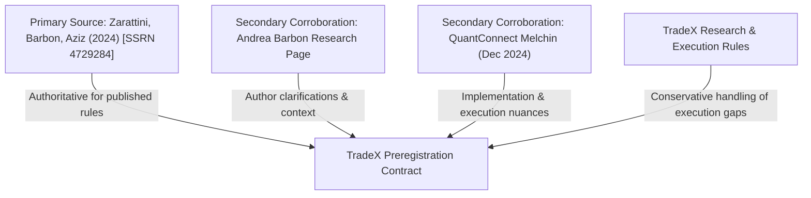
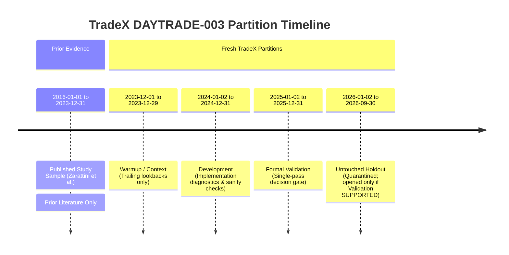
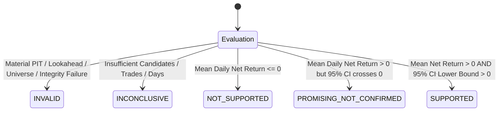

# DAYTRADE-003B: Stocks-in-Play 5-Minute Opening Range Breakout Preregistration

**Task ID:** `DAYTRADE-003B-ORB-PREREG-001`  
**Strategy ID:** `DAYTRADE-003B-ORB-SIP5M`  
**Title:** Preregister the evidence-backed 5-minute Opening Range Breakout on Stocks in Play strategy  
**Repository:** `gyairbyte/TradeX`  
**Classification:** Research-only preregistration  
**Starting Base Commit SHA:** `b15015cb46adf5ceca707589455fc12fbca64c63`  
**Machine-Readable Spec:** [`docs/research/specs/DAYTRADE-003B-ORB-v1.json`](specs/DAYTRADE-003B-ORB-v1.json)  
**Spec JSON SHA-256:** `62f5028c1b11a392aeb596c4e05b8c1f194cc5cec3af1a9406f4fe16c80460c0`

---

## Governance & Boundary Declaration

* **Production Trading Behavior:** `NO CHANGE`
* **Production Strategy Registry:** `APPROVED_PRODUCTION_STRATEGIES == ()` strictly preserved
* **Trading-Logic Implementation:** `NO` (Unauthorized in this task)
* **Backtest Execution:** `NO` (Unauthorized in this task)
* **Historical Market-Data Acquisition:** `NO` (Unauthorized in this task)
* **Private Dataset Access:** `NO` (Unauthorized in this task)
* **Provider API Calls:** `NO` (Zero provider requests)
* **Holdout Partition Access:** `NO` (Strictly quarantined and unopened)
* **Tick-Data Infrastructure Dependency:** `NO` (Superseded; no 50-tick or 133-tick requirements)

---

## 1. Executive Summary & Product Decision

This task executes the strategic research decision approved by Gary Yang: **pivot TradeX day-trading research to the rigorous evaluation of an established, evidence-backed strategy candidate rather than engineering generalized tick-data infrastructure first.**

This assignment explicitly **supersedes** the previously contemplated `DAYTRADE-003B` tick-data-provider feasibility study.

The candidate strategy selected by Gary is the **5-minute Opening Range Breakout (ORB) on Stocks in Play**, grounded primarily in the academic research paper:

> **Carlo Zarattini, Andrea Barbon, Andrew Aziz**  
> *"A Profitable Day Trading Strategy For The U.S. Equity Market"*  
> Swiss Finance Institute Research Paper No. 24-98 / SSRN 4729284 (Reviewed PDF Date: 2024-02-16; SSRN posted February 2024, subsequently revised).

The core thesis of the paper is that applying standard Opening Range Breakout mechanics across the broad universe of liquid equities fails to deliver sustained alpha, but restricting execution exclusively to **"Stocks in Play"**—securities experiencing abnormal relative volume and heightened volatility driven by fresh catalysts—produces substantial, uncorrelated economic edge.

### Critical Boundary: External Prior Evidence vs. TradeX Validation

The published results in the Zarattini et al. (2024) paper (2016–2023 sample period) are recognized strictly as **EXTERNAL PRIOR LITERATURE EVIDENCE**. 
* They do **NOT** prove strategy validity for TradeX.
* They do **NOT** guarantee future profitability.
* They do **NOT** authorize production promotion or live trading.
* TradeX success criteria do **NOT** require reproducing the paper's headline numbers.

TradeX must independently and prospectively evaluate this strategy on completely untouched, fresh data partitions before any claim of tradable edge can be made.

---

## 2. Source-of-Truth Hierarchy & Literature Disclosure

To prevent unprincipled rule drift, TradeX establishes a strict evidence hierarchy for this strategy:

### 2.1 Primary Source
* **Citation:** Carlo Zarattini, Andrea Barbon, Andrew Aziz, *"A Profitable Day Trading Strategy For The U.S. Equity Market"*, Swiss Finance Institute Research Paper No. 24-98, SSRN 4729284.
* **Reviewed PDF Date:** `2024-02-16`.
* **SSRN Revision Note:** SSRN posted February 2024, subsequently revised.
* **Role:** Authoritative source for all published screening, entry, sizing, stop-loss, and exit rules.

### 2.2 Secondary Corroboration
1. **Andrea Barbon’s Research Page:** Author-level documentation providing background context and empirical discussion.
2. **QuantConnect Replication:** Derek Melchin, *"Opening Range Breakout for Stocks in Play"*, QuantConnect Platform Research (December 2024).
   * **Material Universe Divergence:** QuantConnect intentionally tested a restricted universe of the top **1,000 liquid equities** rather than the full **~7,000 U.S. equities** examined in the primary paper.
   * **Platform Divergence:** QuantConnect highlighted minute-resolution order activation nuances (e.g. naive minute-bar engines delaying protective stop-loss activation by one minute).
   * **Rule:** Secondary sources may document implementation risks and clarify edge cases, but **MUST NOT silently overwrite the primary paper**. TradeX does not adopt QuantConnect's 1,000-stock limitation as its primary research design.

### 2.3 Published Headline Results (Prior Literature Only)
As reported by Zarattini et al. (2024) over the 2016-01-01 through 2023-12-31 sample period:
* **Examined Universe:** Approximately 7,000 U.S. equities listed on NYSE and Nasdaq (2016–2023) using the CRSP survivorship-bias-free database, including delisted securities. The primary paper does not state an explicit limitation to common stocks.
* **Portfolio Setup:** Top-20 Stocks in Play traded daily with 5-minute ORB.
* **Cumulative Net Return:** +1,637% total net performance.
* **Annualized Return / IRR:** 41.6%.
* **Annualized Alpha:** ~36.0% (vs. S&P 500).
* **Beta to SPY:** Approximately 0.00 (-0.04 in QuantConnect replication).
* **Sharpe Ratio:** 2.81 (QuantConnect reported ~2.396).
* **Maximum Drawdown:** ~12.0%.

---

## 3. Published Strategy Rules to Preregister

Every strategy parameter below is locked from the primary source without optimization or sensitivity searching.

### 3.1 Regular Trading Session & Opening Range
* **Session Window:** 09:30:00 to 16:00:00 America/New_York (regular trading hours on XNYS calendar).
* **Opening Range Duration:** Exactly the first 5 minutes of regular trading.
* **Constituent 1-Minute Bars:** Completed bars beginning at `09:30`, `09:31`, `09:32`, `09:33`, and `09:34`.
* **Availability Boundary:** The 5-minute opening candle is completed and available only at **09:35:00 ET**.
* **Key Opening Range Attributes:**
  * $\text{OR\_open}$: First executable regular-session trade price (09:30 bar open).
  * $\text{OR\_high}$: Highest price traded during the 09:30:00–09:34:59 interval.
  * $\text{OR\_low}$: Lowest price traded during the 09:30:00–09:34:59 interval.
  * $\text{OR\_close}$: Final executed trade price of the opening interval (09:34 bar close).
  * $\text{OR\_volume}$: Total aggregate shares traded during the first 5 minutes.
* **Discipline:** No strategy decision may access or evaluate the opening range candle prior to `09:35:00 ET`.

### 3.2 Directional Qualification
Direction is established strictly by the relationship between $\text{OR\_close}$ and $\text{OR\_open}$:
* **Bullish Opening Range:** If $\text{OR\_close} > \text{OR\_open}$, security qualifies **strictly for a LONG breakout**. The entry stop level is set at $\text{OR\_high}$.
* **Bearish Opening Range:** If $\text{OR\_close} < \text{OR\_open}$, security qualifies **strictly for a SHORT breakout**. The entry stop level is set at $\text{OR\_low}$.
* **Doji Opening Range:** If $\text{OR\_close} == \text{OR\_open}$, **NO ORDER** is placed.
* **Discipline:** A security may never be eligible for both directions in the same session.

### 3.3 Basic Eligibility Filters
To qualify as an eligible candidate, a stock must pass all three baseline filters using completed historical data prior to session $D$:
1. **Minimum Price Filter:** Opening price $> \$5.00$.
2. **Average Daily Volume (ADV) Filter:** Average daily volume over the trailing 14 completed trading sessions ($D-14$ through $D-1$) $\ge 1,000,000\text{ shares/day}$.
3. **Volatility (ATR) Filter:** 14-day Average True Range ($\text{ATR}_{14}$) over completed sessions prior to $D$ must be $> \$0.50$.

*No parameter tuning, threshold shifting, or substitution (e.g. $\$10$, $\$3$, ATR%, median volume, 20-day lookback) is authorized.*

### 3.4 Stocks-in-Play Relative Volume & Ranking
For each eligible security $j$ on session $D$:
$$\text{Relative Volume}(D, j) = \frac{\text{OR\_volume}(D, j)}{\frac{1}{14}\sum_{k=1}^{14}\text{OR\_volume}(D-k, j)}$$

* **Lookback Sessions:** Exactly the prior 14 completed eligible trading sessions ($D-1$ down to $D-14$). The current session $D$ is strictly excluded from its own denominator.
* **Relative Volume Filter:** $\text{Relative Volume}(D, j) \ge 1.0$.
* **Ranking & Portfolio Selection:** All qualifying securities are ranked descending by Relative Volume. The strategy selects the **TOP 20** Stocks in Play for session $D$.
* **Fewer than 20 Qualified:** If fewer than 20 securities satisfy all eligibility criteria, the strategy trades only the qualifying symbols.
* **Deterministic Tie-Breaker:** In case of identical Relative Volume:
  1. Higher Relative Volume;
  2. Ticker symbol alphabetical ascending (`A` $\rightarrow$ `Z`).  
  *(Labeled explicitly as a TradeX determinism rule, not a published alpha rule).*

### 3.5 Entry Order Execution
* **Order Type:** Stop order placed after the 5-minute opening range is fully finalized (`09:35:00 ET`).
  * Long: Stop-buy order at $\text{OR\_high}$.
  * Short: Stop-sell order at $\text{OR\_low}$.
* **No Self-Touch Lookahead:** An entry order may **not** be filled simply because the opening 5-minute bar itself touched its own high or low. The order becomes active only at/after `09:35:00 ET`.
* **Execution Limit:** At most **one initiated ORB trade** per symbol per session.
* **Order Lifetime:** Order remains active until triggered or canceled at session close. (See Section 11 regarding order lifetime ambiguity).

### 3.6 Average True Range ($\text{ATR}_{14}$) Construction
* $\text{ATR}_{14}$ is calculated using the 14 completed daily sessions available prior to session $D$ ($D-1$ and earlier).
* Current session $D$ price action must never enter the historical ATR computation.
* *TradeX Implementation Detail:* TradeX recommends standard Wilder 14-day ATR smoothing on completed daily bars. The exact smoothing method is preserved in the ambiguity register.

### 3.7 Protective Stop Loss
Immediately upon execution of an entry order:
* **LONG Position:** Stop loss price $= \text{executed\_entry\_price} - (0.10 \times \text{ATR}_{14})$.
* **SHORT Position:** Stop loss price $= \text{executed\_entry\_price} + (0.10 \times \text{ATR}_{14})$.
* **Rule Invariants:** No trailing stop, no breakeven adjustment, no profit target, no alternative stop loss.

### 3.8 Position Liquidation & Exit
* **Intraday Stop Exit:** If the protective stop price is touched or penetrated during regular trading hours, the position is liquidated immediately subject to the execution model.
* **End-of-Day (EOD) Exit:** If the protective stop is not triggered, the position is closed at the end of the regular trading session.
* **Overnight Prohibition:** No position is held overnight under any circumstance.
* **1-Minute Bar Convention:** Completed 15:59–16:00 bar close liquidation convention locked as TradeX execution rule (Option A; non-blocking; see AMB-08).

### 3.9 Position Sizing & Leverage
* **Published Capital Base:** $\$25,000$ initial capital.
* **Published Source Language:** Each stock was sized so that if the stop were hit, the loss on the capital deployed for that position would be approximately 1%, subject to a 4x leverage constraint.
* **Deployed Capital Loss Target:** 1.0% loss on deployed capital for that position if stop hit (`source_reported_deployed_capital_loss_pct: 1.0`).
* **Leverage Constraint:** Maximum portfolio leverage of **4×** intraday (consistent with FINRA Rule 4210 pattern day trader margin).
* **Concurrent Portfolio Sizing Semantics:** The primary paper does not detail the mathematical formula for portfolio NAV compounding, pro-rata scaling, or margin allocation across concurrent open positions when multiple of the 20 candidate setups trigger. TradeX does not claim a portfolio NAV sizing formula. This mathematics is cataloged as `MUST_RESOLVE_FOR_EVALUATOR` under AMB-03 for resolution in `DAYTRADE-003C`.

---

## 4. Universe Contract & Data Feasibility

The primary source examined approximately **7,000 U.S. equities** listed on NYSE and Nasdaq across 2016–2023 using the CRSP survivorship-bias-free database, including delisted securities. The primary paper does not state an explicit limitation to common stocks.

TradeX locks the following universe contract:
1. **Primary Research Target:** Point-in-time U.S.-listed NYSE and Nasdaq equities consistent with Zarattini et al. (2024), subject to basic eligibility filters.
2. **Anti-Drift Rule:** TradeX must **NOT** silently substitute a convenient subset—such as the Dow 30, S&P 500, ETF presets, or current top-1,000 liquid names—as the primary study.
3. **Data-Feasibility Milestone:** Full point-in-time historical constituent reconstruction, delisting treatment, merger tracking, and corporate identifier mapping represent data-feasibility requirements to be evaluated in `DAYTRADE-003C`. If full ~7,000-stock point-in-time reconstruction proves cost-prohibitive, any smaller operational universe adaptation must be formally defined as a **VARIANT** and explicitly approved by Gary Yang and ChatGPT.
4. **Security-Type Mapping Status:** Exact CRSP security-type mapping needed to reproduce the source universe (treatment of ADRs, REITs, closed-end funds, multiple share classes, etc.) is preserved under AMB-01 as `MUST_RESOLVE_FOR_DATASET`.

### Primary Data Classes Required
* Daily OHLCV (for ADV14 and ATR14 calculations);
* Regular-session 1-minute OHLCV (09:30–16:00 ET for opening range, entry, and intraday tracking);
* Point-in-time security/universe membership and corporate-actions reference data.

### Source Data Citations
* **Intraday Data:** IQFeed regular-session intraday data, explicitly unadjusted for stock splits and dividends in the primary source paper.
* **Universe Reference:** CRSP survivorship-bias-free database (NYSE and Nasdaq equities, including delistings).

### Explicitly Excluded & Prohibited Data Classes
To prevent infrastructure rabbit holes, the following data classes are **strictly excluded** from the historical research design:
* Raw tick trade data;
* 50-tick and 133-tick bars;
* Level 2 order book / market depth;
* Real-time WebSocket streaming;
* Options chains and options flow;
* Real-time news or social sentiment feeds.

---

## 5. Temporal Splits & Research Partitions

TradeX enforces strict separation between the published sample period and fresh prospective evaluation partitions:

| Partition | Date Range | Calendar Sessions | Role & Governance Restrictions |
|---|---|---|---|
| **Published Sample** | `2016-01-01` to `2023-12-31` | ~2,014 | Prior external evidence only. Never rerun for TradeX validation. |
| **Warmup / Context** | `2023-12-01` to `2023-12-29` | $\ge 14$ sessions | Trailing calculations (ADV, ATR, RV). Zero strategy trades; zero development outcomes. |
| **Development** | `2024-01-02` to `2024-12-31` | ~252 | Implementation diagnostics & execution sanity checks. **No parameter tuning authorized.** |
| **Formal Validation** | `2025-01-02` to `2025-12-31` | ~252 | Primary decision partition. Evaluated exactly once. |
| **Untouched Holdout** | `2026-01-02` to `2026-09-30` | ~188 | Strictly quarantined. Accessible **ONLY** if Validation earns `SUPPORTED`. October 2026 excluded as incomplete month. |

---

## 6. Execution-Model Rules & Resolving 1-Minute Ambiguities

Modeling continuous intraday stop orders on discrete 1-minute OHLC bars introduces execution ambiguities. TradeX establishes conservative, fail-closed execution rules:

### 6.1 Stop-Entry Trigger and Fill Rules
Continuous stop orders evaluated on discrete 1-minute bars follow a strict, deterministic 3-step conditional trigger rule using `>=` and `<=` so that opening prints exactly at the stop level are executable:

* **For LONG stop-buy order at price $P$:**
  * **Step 1 (Open Trigger):** If $\text{bar\_open} \ge P$: fill at $\text{bar\_open}$ (gap-through slippage taken).
  * **Step 2 (Intrabar Trigger):** Else if $\text{bar\_high} \ge P$: fill at $P$.
  * **Step 3 (No Fill):** Else (i.e. $\text{bar\_open} < P$ and $\text{bar\_high} < P$): **NO FILL** (order remains active subject to locked order-lifetime rule).

* **For SHORT stop-sell order at price $P$:**
  * **Step 1 (Open Trigger):** If $\text{bar\_open} \le P$: fill at $\text{bar\_open}$ (gap-through slippage taken).
  * **Step 2 (Intrabar Trigger):** Else if $\text{bar\_low} \le P$: fill at $P$.
  * **Step 3 (No Fill):** Else (i.e. $\text{bar\_open} > P$ and $\text{bar\_low} > P$): **NO FILL** (order remains active subject to locked order-lifetime rule).

* **Classification:** `TRADEX_EXECUTION_RULE` / `LOCKED_TRADEX_EXECUTION_CONVENTION`. Prevents unrealistically favorable fills on opening breakouts and specifies explicit non-fill handling.

### 6.2 Stop-Loss Gap-Through Rule
* **Rule:** If the market gaps beyond the protective stop loss level:
  * Fill at the worse executable opening price ($\text{bar\_open}$), not the exact stop price.
* **Classification:** `TRADEX_EXECUTION_RULE`. Reflects adverse execution during rapid momentum reversals.

### 6.3 Same-Bar Entry and Stop Ambiguity Rule
* **Rule:** If a single 1-minute bar triggers both the breakout entry and penetrates the protective stop loss, and intrabar tick sequencing is not available:
  * **Fail Closed Assumption:** Assume the entry was filled first, and the protective stop was subsequently hit in the same bar (maximum conservative loss).
  * The evaluator must track and report `same_bar_ambiguity_count`.
  * Favorable intrabar ordering assumptions are strictly prohibited.
* **Classification:** `TRADEX_EXECUTION_RULE`.

### 6.4 Stop-Loss Immediate Activation Timing Rule
* **Rule:** The protective stop loss order is economically active **immediately upon hypothetical entry fill**.
  * A naive 1-minute engine must **not** allow an unprotected 1-minute window after entry.
  * If bar resolution cannot verify safety, the same-bar ambiguity rule applies.
* **Classification:** `TRADEX_EXECUTION_RULE`.

---

## 7. Friction & Transaction-Cost Scenarios

TradeX evaluates strategy economics across three predefined friction models. No parameter searching across transaction costs is authorized.

| Scenario | Description | Commission | Adverse Slippage | Purpose |
|---|---|---|---|---|
| **Scenario A** | Source Comparison | $\$0.0035$ / share | $0.0\text{ bps}$ / side | Direct comparability to published Zarattini et al. results. (Not promotion-quality). |
| **Scenario B** | TradeX Primary | $\$0.0035$ / share | $2.0\text{ bps}$ / side | **Primary decision hurdle for validation gates.** |
| **Scenario C** | Stress Robustness | $\$0.0035$ / share | $5.0\text{ bps}$ / side | Robustness stress diagnostic. (Negative result does not auto-fail formal support). |

---

## 8. Outcome Metrics & Decision Hierarchy

The eventual evaluator must report comprehensive trade-level and portfolio-level metrics:

### Primary Decision Metric
$$\text{Primary Metric} = \text{Mean Daily Portfolio Net Return under TradeX Primary Costs (Scenario B)}$$

### Secondary & Diagnostic Metrics
* **Trade-Level:** Qualified candidate count, entry orders placed, triggered trade count, long/short trade ratio, win rate, mean/median R-multiple, mean/median gross and net returns, stop-out rate, EOD exit rate, same-bar ambiguity count, non-computable trade count.
* **Portfolio/Session-Level:** Daily portfolio return distribution, cumulative net return, annualized return, annualized volatility, Sharpe ratio, maximum drawdown, worst single-day return, turnover, gross exposure, leverage utilization, annualized alpha and beta vs. SPY.

---

## 9. Prospective Research Disposition Taxonomy

Prospectively applied to the `DAYTRADE-003` program:

1. **`INVALID`:** Material point-in-time, lookahead, survivorship, universe construction, or execution integrity failure.
2. **`INCONCLUSIVE`:** Evidence is insufficient to reach an economic conclusion (e.g. fails minimum trade or session counts).
3. **`NOT_SUPPORTED`:** Adequate evidence indicates the strategy produces zero or negative net return under TradeX primary costs ($\text{mean daily net return} \le 0$).
4. **`PROMISING_NOT_CONFIRMED`:** Point estimate is economically positive ($\text{mean daily net return} > 0$), but statistical confidence is not established ($95\%\text{ bootstrap CI crosses zero}$).
5. **`SUPPORTED`:** All validation gates pass: positive economics under primary friction with $95\%\text{ bootstrap CI lower bound} > 0$.

---

## 10. Formal Validation Decision Gates

Evaluated strictly on the **2025 Validation Partition** (`2025-01-02` through `2025-12-31`):

1. **Integrity Gate:** Zero material point-in-time, data leakage, lookahead, or universe integrity violations.
   * *Failure Disposition:* `INVALID`.
2. **Evidence-Sufficiency Gate:**
   * $\ge 100$ regular trading sessions with at least one eligible Stocks-in-Play candidate;
   * $\ge 500$ triggered trades total;
   * $\ge 50$ unique traded securities.
   * *Failure Disposition:* `INCONCLUSIVE`.
3. **Primary Economics Gate:**
   * Mean daily portfolio net return under TradeX Primary Costs (Scenario B) $> 0.0$.
   * *Failure Disposition:* `NOT_SUPPORTED`.
4. **Statistical-Confidence Gate:**
   * Session-date block bootstrap $95\%$ confidence interval lower bound for mean daily portfolio net return $> 0.0$.
   * *Failure Disposition (if point estimate $> 0$):* `PROMISING_NOT_CONFIRMED`.
5. **Cost-Survival & Robustness Diagnostics:**
   * Report Scenario C ($5\text{ bps/side}$ slippage) as a diagnostic.
   * Report stability across quarters, long vs. short trades, relative volume deciles, and broad market return regimes.

### Holdout Quarantine Invariant
The **2026 Holdout Partition** (`2026-01-02` through `2026-09-30`) remains strictly unacquired, unread, and unopened. It may be evaluated **ONLY IF** Validation earns the formal disposition **`SUPPORTED`**. Under `INVALID`, `INCONCLUSIVE`, `NOT_SUPPORTED`, or `PROMISING_NOT_CONFIRMED`, holdout access is strictly prohibited.

---

## 11. Parameter-Fishing Prohibitions

To protect against data mining and overfitting, the following actions are **strictly prohibited**:
* Testing alternative opening range durations (e.g. 1m, 2m, 3m, 10m, 15m) and picking the best;
* Changing portfolio concentration from Top 20 (e.g. Top 10, Top 30);
* Altering the Relative Volume threshold from $1.0$;
* Replacing the absolute $\$0.50$ ATR filter with ATR percentage or different thresholds;
* Altering the $\$5.00$ minimum price or $1,000,000$ share volume filters;
* Adding technical indicator overlays (VWAP, Moving Averages, RSI, MACD);
* Adding news, social, or earnings sentiment feeds;
* Introducing profit targets or take-profit orders;
* Modifying the stop-loss distance from $0.10 \times \text{ATR}_{14}$;
* Adding trailing stops or breakeven stops;
* Cherry-picking long-only or short-only execution post-hoc;
* Restricting to favorable sectors or market cap bands after seeing results;
* Selecting favorable intraday execution windows;
* Tuning transaction costs to engineer profitability;
* Altering the session-close exit timing.

---

## 12. Source Audit Table

Every material strategy rule is classified into one of the normative statuses:
* `SOURCE_EXPLICIT`: Directly defined and stated in Zarattini et al. (2024);
* `SOURCE_INFERRED`: Strongly supported by the text and methodology of Zarattini et al. (2024);
* `TRADEX_EXECUTION_RULE`: Added by TradeX to enforce conservative, reproducible execution;
* `LOCKED_TRADEX_EXECUTION_CONVENTION`: Preserved as a locked, reproducible TradeX execution convention;
* `MUST_RESOLVE_FOR_DATASET`: Data-layer requirement to be resolved before dataset construction in DAYTRADE-003C;
* `MUST_RESOLVE_FOR_EVALUATOR`: Engine-layer requirement to be resolved before evaluator implementation in DAYTRADE-003C;
* `NON_BLOCKING_SOURCE_DIFFERENCE`: Documented divergence between source and TradeX design that does not block execution.

| Rule Area | Exact Value / Formula | Source Type | Source Evidence | TradeX Interpretation | Status |
|---|---|---|---|---|---|
| **Opening Range Duration** | 5 minutes (`09:30–09:35 ET`) | Primary Paper | Section 2 / Abstract | First five 1-minute bars; completed at 09:35:00 ET | `SOURCE_EXPLICIT` |
| **Direction Bias** | Bullish if Close > Open; Bearish if Close < Open | Primary Paper | Section 2.1 | Long stop at OR_high; Short stop at OR_low | `SOURCE_EXPLICIT` |
| **Doji Handling** | If Close == Open: No order | Primary Paper | Section 2.1 | Zero order placed; no trade | `SOURCE_EXPLICIT` |
| **Price Filter** | Opening price $> \$5.00$ | Primary Paper | Section 2.2 | Opening print of session $D > \$5.00$ | `SOURCE_EXPLICIT` |
| **Volume Filter** | ADV14 $\ge 1,000,000$ shares/day | Primary Paper | Section 2.2 | Mean volume across prior 14 completed trading days | `SOURCE_EXPLICIT` |
| **Volatility Filter** | ATR14 $> \$0.50$ | Primary Paper | Section 2.2 | 14-day ATR across prior completed sessions | `SOURCE_EXPLICIT` |
| **Relative Volume Formula** | $\text{OR\_vol}(D) / \text{mean}(\text{OR\_vol}(D-1..D-14))$ | Primary Paper | Section 2.2 | Current session excluded from denominator | `SOURCE_EXPLICIT` |
| **Relative Volume Cutoff** | $\text{Relative Volume} \ge 1.0$ | Primary Paper | Section 2.2 | Must be at least 100% of 14-day baseline | `SOURCE_EXPLICIT` |
| **Portfolio Top-N** | Top 20 Stocks in Play | Primary Paper | Section 2.3 | Rank qualifying descending by RV; pick up to 20 | `SOURCE_EXPLICIT` |
| **Tie-Breaker Rule** | Ticker ascending tie-break | TradeX Rule | Paper silent on RV ties | Deterministic secondary sort: alphabetical ticker | `TRADEX_EXECUTION_RULE` |
| **Entry Order Type** | Stop-buy at OR_high / Stop-sell at OR_low | Primary Paper | Section 2.3 | Active at/after 09:35:00 ET; no self-touch fill | `SOURCE_EXPLICIT` |
| **Max Trades per Symbol** | 1 initiated trade / symbol / session | Primary Paper | Section 2.3 | At most one ORB execution per symbol per day | `SOURCE_EXPLICIT` |
| **Order Cancellation Timing** | Available until hit or session close | Inferred / TradeX | Paper mentions no earlier intraday cutoff | Stop order remains open 09:35–16:00 ET | `LOCKED_TRADEX_EXECUTION_CONVENTION` |
| **Stop Loss Distance** | $0.10 \times \text{ATR}_{14}$ | Primary Paper | Section 2.4 | Entry $\mp (0.10 \times \text{ATR}_{14})$ | `SOURCE_EXPLICIT` |
| **Profit Target** | None (Exit at market close) | Primary Paper | Section 2.4 | No profit target; hold until stop or EOD | `SOURCE_EXPLICIT` |
| **Overnight Hold** | Strictly prohibited (0 overnight) | Primary Paper | Section 2.4 | Liquidate at regular session close (16:00 ET) | `SOURCE_EXPLICIT` |
| **Initial Capital** | $\$25,000$ | Primary Paper | Section 3.1 | Baseline starting portfolio equity | `SOURCE_EXPLICIT` |
| **Leverage Cap** | Maximum 4× | Primary Paper | Section 3.1 | FINRA pattern day trader intraday margin cap | `SOURCE_EXPLICIT` |
| **Position Sizing Risk** | ~1% loss on deployed capital per position | Primary Paper | Section 3.1 | Sized so stop loss is 1% loss on deployed capital | `SOURCE_EXPLICIT` |
| **Replication Commission** | $\$0.0035$ per share | Primary Paper | Section 3.2 | IBKR Pro tiered pricing model | `SOURCE_EXPLICIT` |
| **Stop Trigger & Gap Fill** | 3-step conditional trigger; worse open on gap | TradeX Rule | Paper silent on discrete bar gap | Deterministic open, intrabar, or NO FILL | `LOCKED_TRADEX_EXECUTION_CONVENTION` |
| **Same-Bar Entry & Stop** | Assume entry filled then stopped out | TradeX Rule | Paper silent on intrabar collision | Conservative worst-case fail closed | `LOCKED_TRADEX_EXECUTION_CONVENTION` |
| **Stop Activation Timing** | Active immediately on entry | TradeX Rule | QuantConnect noted naive engine delay | Protective stop active in entry minute | `TRADEX_EXECUTION_RULE` |
| **Session-Close Liquidation**| Completed 15:59–16:00 bar close (Option A) | TradeX Rule | Paper states close (4:00 PM) | Locked execution rule Option A | `LOCKED_TRADEX_EXECUTION_CONVENTION` |
| **CRSP Universe Scope** | ~7,000 U.S. equities, delisted included | Primary Paper | CRSP survivorship-bias-free | Security-type inclusion/exclusion mapping needed | `MUST_RESOLVE_FOR_DATASET` |
| **Intraday Data Adjustments**| IQFeed unadjusted for splits/dividends | Primary Paper | IQFeed regular-session data | Alignment with daily historical series needed | `MUST_RESOLVE_FOR_DATASET` |
| **ATR Smoothing** | Wilder 14-day smoothing | TradeX Proposal | Paper says "14-day ATR" | Recommended conventional smoothing | `MUST_RESOLVE_FOR_EVALUATOR` |
| **Concurrent Capital Sizing**| Allocation across up to 20 trades | Primary Paper | Paper reports portfolio return | Portfolio compounding & pro-rata margin math | `MUST_RESOLVE_FOR_EVALUATOR` |
| **Commission Minimums** | Ticket minimum fees ($0.35 / $1.00) | TradeX Audit | Paper cites $0.0035/share | Impact on small share sizes to evaluate | `MUST_RESOLVE_FOR_EVALUATOR` |
| **Source Engine Resolution** | 1m vs 5m vs tick engine resolution | Primary Paper | Paper silent on internal engine | Non-blocking; TradeX evaluates 1-minute rules | `NON_BLOCKING_SOURCE_DIFFERENCE` |

---

## 13. Source Ambiguity Register

The following ambiguities remain after thorough review of Zarattini et al. (2024), Barbon's research page, and Melchin's replication. Each item is classified by its normative role and resolution requirement:

### AMB-01: CRSP Security-Type Universe Inclusion/Exclusion Mapping
* **Classification:** `MUST_RESOLVE_FOR_DATASET`
* **Source Explicit:** The paper explicitly analyzes approximately 7,000 U.S. equities on NYSE and Nasdaq across 2016–2023 from the CRSP survivorship-bias-free database, including delisted securities. The primary paper does not state an explicit limitation to common stocks.
* **Still Unresolved for TradeX:** Exact CRSP security-type mapping needed to reproduce the source universe: treatment of ADRs, REITs, closed-end funds, multiple share classes, and other security-type edge cases.
* **Resolution Requirement:** `MUST_RESOLVE_BEFORE_DAYTRADE-003C_DATASET_CONSTRUCTION`.

### AMB-02: Exact Numerical ATR Smoothing Method
* **Classification:** `MUST_RESOLVE_FOR_EVALUATOR`
* **Description:** The paper specifies a 14-day ATR filter ($> \$0.50$) and stop distance ($0.10 \times \text{ATR}_{14}$), but does not distinguish between Wilder's smoothing, exponential moving average, or simple rolling average.
* **Impact:** Modest numerical variance on stop distance and candidate qualification.
* **Proposed TradeX Convention:** Standard Wilder 14-day ATR on completed daily bars ($D-1$ and earlier).
* **Resolution Requirement:** `MUST_RESOLVE_BEFORE_DAYTRADE-003C_EVALUATOR_IMPLEMENTATION`.

### AMB-03: Concurrent-Portfolio 1% Deployed Capital Risk Sizing Mathematics
* **Classification:** `MUST_RESOLVE_FOR_EVALUATOR`
* **Source Explicit:** Each stock was sized so that if the stop were hit, the loss on the capital deployed for that position would be approximately 1%, subject to a 4x leverage constraint. Initial capital $25,000.
* **Still Unresolved for TradeX:** The paper does not provide the exact mathematical formula for portfolio NAV compounding, pro-rata scaling, and margin consumption when multiple of the 20 candidate setups trigger concurrently. TradeX does not claim a portfolio NAV sizing formula.
* **Resolution Requirement:** `MUST_RESOLVE_BEFORE_DAYTRADE-003C_EVALUATOR_IMPLEMENTATION`.

### AMB-04: Stop-Entry Order Lifetime & Cancellation
* **Classification:** `LOCKED_TRADEX_EXECUTION_CONVENTION`
* **Description:** The paper implies that stop entry orders remain valid throughout the regular session until triggered or market close; it does not define an earlier cutoff.
* **Locked Convention:** Stop order remains active from 09:35 ET until filled or session close (16:00 ET).
* **Resolution Requirement:** `RESOLVED_AS_LOCKED_TRADEX_EXECUTION_CONVENTION`.

### AMB-05: Source Engine Intraday Bar Resolution
* **Classification:** `NON_BLOCKING_SOURCE_DIFFERENCE`
* **Description:** The source backtest engine resolution (1-minute vs 5-minute vs tick) is unknown.
* **Resolution:** Non-blocking difference because TradeX explicitly evaluates against locked conservative 1-minute execution rules.
* **Resolution Requirement:** `NON_BLOCKING_SOURCE_DIFFERENCE`.

### AMB-06: Stop-Entry & Stop-Loss Gap-Through Fill Treatment
* **Classification:** `LOCKED_TRADEX_EXECUTION_CONVENTION`
* **Description:** Handling of gap-through fills on stop-entry and stop-loss orders in discrete 1-minute bars.
* **Locked Convention:** Conservative 3-step conditional trigger rules for entries (open, intrabar, or NO FILL) and fill at worse open if gap-through occurs on stops.
* **Resolution Requirement:** `RESOLVED_AS_LOCKED_TRADEX_EXECUTION_CONVENTION`.

### AMB-07: Same-Bar Entry and Stop Path Collision
* **Classification:** `LOCKED_TRADEX_EXECUTION_CONVENTION`
* **Description:** Intrabar path ambiguity when both entry and stop price levels are touched within the same 1-minute bar.
* **Locked Convention:** Conservative fail-closed assumption: entry triggered, stop hit in same bar; reported in `same_bar_ambiguity_count`.
* **Resolution Requirement:** `RESOLVED_AS_LOCKED_TRADEX_EXECUTION_CONVENTION`.

### AMB-08: Session-Close Liquidation Price Convention
* **Classification:** `LOCKED_TRADEX_EXECUTION_CONVENTION`
* **Description:** The paper specifies positions liquidated at market close (4:00 PM), but does not distinguish between MOC cross and bar close.
* **Locked Convention:** Completed 15:59–16:00 1-minute bar close liquidation convention locked as TradeX execution rule (Option A; non-blocking).
* **Resolution Requirement:** `RESOLVED_AS_LOCKED_TRADEX_EXECUTION_CONVENTION`.

### AMB-09: Commission Fee Structure & Minimum Ticket Fees
* **Classification:** `MUST_RESOLVE_FOR_EVALUATOR`
* **Description:** The paper cites $\$0.0035$ per share (matching IBKR tiered pricing), but does not clarify whether IBKR minimum ticket fees ($\$0.35$ or $\$1.00$ per order) or exchange regulatory fees were modeled.
* **Impact:** Must determine whether IBKR ticket minimums materially affect small share positions in TradeX.
* **Resolution Requirement:** `MUST_RESOLVE_BEFORE_DAYTRADE-003C_EVALUATOR_IMPLEMENTATION`.

### AMB-10: Corporate Action Adjustment Consistency Between Daily and Intraday Data
* **Classification:** `MUST_RESOLVE_FOR_DATASET`
* **Source Explicit:** Intraday stock data from IQFeed were explicitly unadjusted for stock splits and dividends.
* **Still Unresolved for TradeX:** Exact daily-data adjustment convention for ATR and average-volume calculations (split-only vs total return in CRSP); how daily inputs and unadjusted intraday data were aligned across splits; and what deterministic TradeX convention reproduces internally consistent prices.
* **Resolution Requirement:** `MUST_RESOLVE_BEFORE_DAYTRADE-003C_DATASET_CONSTRUCTION`.

---

## 14. Roadmap & Recommended Next Steps

With `DAYTRADE-003B` preregistration complete:
1. **Prior Proposal Superseded:** The earlier proposed tick-data-provider feasibility study is officially superseded and not authorized.
2. **No Tick Infrastructure Needed:** The 5-minute ORB candidate requires standard 1-minute and daily OHLCV data; generalized tick infrastructure is not required.
3. **Recommended Next Task:**
   * **`DAYTRADE-003C`:** Source Ambiguity Resolution & Evaluator / Data-Feasibility Readiness.
   * `DAYTRADE-003C` should resolve material ambiguities (`AMB-01` through `AMB-10`), construct synthetic evaluator test harnesses, and perform bounded data feasibility checks.
   * **Authorization Status:** Not authorized automatically. Requires explicit Gary Yang / ChatGPT approval before initiation.
