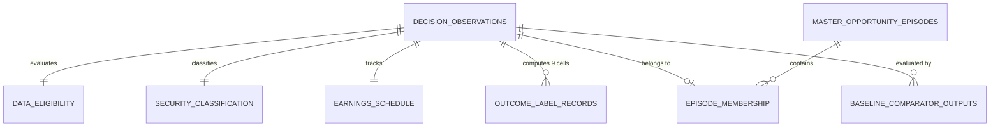
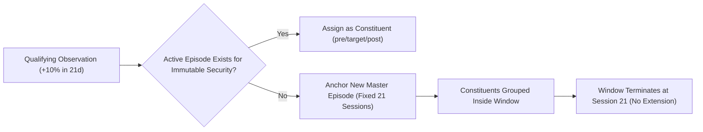

# LONG-002C: Outcome Census, Master Episodes, and Frozen Baseline Design Specification

> **Task ID:** `LONG-002C-DESIGN-001`  
> **Program:** `LONG-002` (Rapid-Upside Long Opportunity Program)  
> **Classification:** Research-Governance / Design-Only  
> **Status:** `proposed_for_gary_review`  
> **Base Commit SHA:** `afa9b40d039e08df1a5edb1be21fb53ee8e0d9aa`  
> **Companion Specification:** [`docs/research/specs/LONG-002C-design-v1.json`](specs/LONG-002C-design-v1.json)  
> **Work Authorized by Gary:** 2026-09-20 (Design / Specification work ONLY)  
> **Execution / Dataset Construction Authorized:** **FALSE**

---

## 1. Executive Summary & Authorization Boundaries

This document defines the research-governance design and implementation contract for the future `LONG-002C` development execution phase.

`LONG-002C` is the development-only phase dedicated to:
1. **Outcome Census:** Evaluating all nine locked target/horizon combinations across the natural market prevalence of U.S. common stocks.
2. **Master Opportunity Episodes:** Grouping constituent observations into 21-session non-recursive independent episodes to prevent overlapping observation bias.
3. **Endpoint and Base-Rate Feasibility:** Measuring empirical prevalence and statistical concentration on the development split (2016–2020) to derive future sample-count gates and evaluate the primary endpoint versus the sole locked fallback.
4. **Frozen Baseline Census:** Evaluating the locked comparator families (universe base rate, simple momentum, SPY-relative momentum, valid PIT-sector relative momentum, volatility-aware momentum, and the existing TradeX long-term scorer) on common observations and freezing the strongest simple comparator.

### Review Dispositions & Design Direction Approvals (2026-09-20)

In review of PR #84, Gary and ChatGPT reviewed open design questions and approved three key design directions:
1. **Warm-Up Lookback:** Accept truthful early-2016 sample attrition for now; do **not** authorize a new 2015 provider probe. If later execution shows attrition materially compromises evidence sufficiency, return for a separate bounded provider decision.
2. **Raw vs. Actionable Census:** Approved dual-reporting design direction. Raw market prevalence is measured across all eligible common stocks regardless of earnings-schedule status; actionable setup density requires point-in-time known earnings schedules.
3. **Endpoint Feasibility Framework:** Approved dependence-aware block resampling (21-session primary / 42-session robustness time blocks) on development data to derive precision bounds and proposed gates before any validation access; no validation or holdout counts.

> [!IMPORTANT]
> **Strict Governance Boundary:** These review dispositions approve **DESIGN DIRECTION ONLY**. They do **NOT** authorize `LONG-002C` execution, historical dataset construction, provider API calls, outcome calculations, validation access, holdout access, model fitting, or production changes.

### Strict Governance Invariants

* **Design Only:** Gary explicitly authorized resuming `LONG-002C` design work on 2026-09-20. That authorization is strictly limited to specification and deterministic test development.
* **Dataset Construction Prohibited:** No historical dataset construction, provider downloads, or live market-data fetches are authorized by this document.
* **Outcome Analysis Prohibited:** No real historical outcomes are calculated or analyzed in this phase.
* **Validation & Holdout Quarantine:** Validation (2021–2022) and Holdout (2023–2025) splits remain strictly unread, unparsed, and untouched. No code path may inspect validation or holdout data to determine sample size or feasibility.
* **Model Fitting Prohibited:** No model fitting, hyperparameter optimization, feature selection, or ranking calibration occurs in `LONG-002C`.
* **Production Boundary:** The production strategy registry remains empty (`APPROVED_PRODUCTION_STRATEGIES == ()`). No production scorers, signals, weights, alerts, UI components, or SQLite tables are modified.
* **R7 Infrastructure Untouched:** The 2026 prospective PIT capture runtime (`tradex/pit/**`), Candidate C operational manifest, and Windows Task Scheduler activation remain completely untouched.

---

## 2. Authorization, Lineage, and Provenance

This specification directly inherits and preserves all locked upstream contracts. Future execution must verify that these upstream files match their exact SHA-256 hashes:

| Specification Document | File Path | Verified SHA-256 Hash | Status |
|---|---|---|---|
| `LONG-002-v1.json` | `docs/research/specs/LONG-002-v1.json` | `f3df2845543500985c88568f9b855812576e9e4a10901f8a5f7a1834a319b3b5` | Locked |
| `LONG-002.md` | `docs/research/LONG-002.md` | `ef5486dca601ff6cf8cfc552737c40024818e0dfefd19d66686293584406bb37` | Locked |
| `LONG-002B-probe-v1.json` | `docs/research/specs/LONG-002B-probe-v1.json` | `002a0795096ba0f6f77ba1f2e673b5d3e6a2008730a57f7f87e71cf86b949a98` | Locked |
| `LONG-002B-DATA-FEASIBILITY.md` | `docs/research/LONG-002B-DATA-FEASIBILITY.md` | `aa13e9361e9cb7e0a50d819076a6c590f9d2df4c566b0d881406d0fa42cd3b54` | Locked |
| `LONG-002B-data-contract-v1.json` | `docs/research/specs/LONG-002B-data-contract-v1.json` | `f8ad6655e482fe5c9e8847467643bf0b03949686ad914180599323758cbf555a` | Locked |
| `LONG-002B-AMEND-001-probe-v1.json` | `docs/research/specs/LONG-002B-AMEND-001-probe-v1.json` | `38f550b3bf14bc58654ba5286213bbfe894577ccb1502b604f60076e6e239ce7` | Locked |
| `LONG-002B-AMEND-001.md` | `docs/research/LONG-002B-AMEND-001.md` | `e2487b0471fdf7b9f8c37316241e2a39ae470cdc8dfed7319e96354c9b5d18d1` | Locked |
| `LONG-002B-DEC-001.json` | `docs/research/specs/LONG-002B-DEC-001.json` | `6d750f7b1c6981db648d647883e8d3d493498eed7d36d2b282d969ea4eec1633` | Locked |
| `LONG-002B-DEC-001.md` | `docs/research/LONG-002B-DEC-001.md` | `6c2179ff5e73bbe655c101814fa98c66bc7c09c803e98f2afbaeda98c0b25026` | Locked |
| `LONG-002B-AMEND-002.json` | `docs/research/specs/LONG-002B-AMEND-002.json` | `455457dab25d212857891499b80d316576392cbb2694950d6467b4034f304b80` | Locked |
| `LONG-002B-AMEND-002.md` | `docs/research/LONG-002B-AMEND-002.md` | `9ff7f639bc0c2da5816684658f4bb2472f8a75e88453e0ad485c26fa6a07f3b3` | Locked |

---

## 3. Dataset & Manifest Architecture

Future execution must generate an immutable, fully auditable dataset partitioned into eleven explicit relational entities.

### Core Entity Schemas & Constraints



1. **`decision_observations`**
   - *Primary Key:* `(immutable_security_id, as_of_date, cutoff_time)`
   - *Ordering:* `as_of_date ASC, immutable_security_id ASC, cutoff_time ASC`
   - *Fields:* `immutable_security_id` (str), `immutable_issuer_id` (str | null), `ticker_at_decision` (str), `as_of_date` (ISO date), `cutoff_time` (`20:30` | `09:00`), `decision_timestamp_utc` (ISO datetime), `as_traded_close` (float), `split_normalized_close` (float), `volume` (int), `dollar_volume_20d_median` (float | null), `atr_14` (float | null), `raw_outcome_eligible` (bool), `universe_eligible` (bool), `data_complete` (bool), `earnings_schedule_status` (`known` | `unknown`), `actionability_status` (`eligible` | `unavailable_earnings_unknown` | `unavailable_data_incomplete` | `excluded`), `split_boundary_purged` (bool).
2. **`data_eligibility`**
   - *Primary Key:* `(immutable_security_id, as_of_date, cutoff_time)`
   - *Fields:* `immutable_security_id` (str), `ticker_at_decision` (str), `price_gte_5` (bool), `dollar_volume_20d_gte_20m` (bool), `dollar_volume_60d_gte_10m` (bool | null), `market_cap_gte_3b` (bool | null), `index_membership_verified` (bool), `trading_history_sessions` (int), `cohort_type` (`established` | `recent_ipo` | `insufficient_history`), `eligibility_passed` (bool), `rejection_reason_codes` (list[str]).
3. **`security_classification_status`**
   - *Primary Key:* `(immutable_security_id, as_of_date)`
   - *Fields:* `immutable_security_id` (str), `ticker_at_decision` (str), `provider_type_code` (str | null), `inferred_classification` (`common_stock` | `etf` | `etn` | `closed_end_fund` | `preferred` | `warrant` | `right` | `unit` | `pre_merger_spac` | `shell` | `otc` | `unknown`), `classification_status` (`supported_common_stock` | `excluded_security_type` | `unknown_fail_closed`), `is_eligible_common_stock` (bool), `provenance_source` (str).
4. **`earnings_schedule_status`**
   - *Primary Key:* `(immutable_security_id, as_of_date, cutoff_time)`
   - *Fields:* `immutable_security_id` (str), `ticker_at_decision` (str), `next_earnings_date` (ISO date | null), `announcement_timing` (`before_market_open` | `after_market_close` | `during_trading_hours` | `unspecified` | null), `sessions_to_earnings` (int | null), `schedule_status` (`known_point_in_time` | `unknown`), `provenance_source` (str).
5. **`outcome_label_records`**
   - *Primary Key:* `(immutable_security_id, as_of_date, cutoff_time, target_pct, horizon_sessions)`
   - *Ordering:* `as_of_date ASC, immutable_security_id ASC, target_pct ASC, horizon_sessions ASC`
   - *Fields:* `immutable_security_id` (str), `ticker_at_decision` (str), `reference_entry_price` (float), `entry_friction_bps` (float), `target_price` (float), `adverse_barrier_pct` (float), `adverse_barrier_price` (float), `clean_risk_cap_pct` (float), `clean_risk_cap_amount` (float), `mfe_pct` (float), `target_progress_ratio` (float), `near_miss` (bool), `partial_move` (bool), `mae_pct` (float), `mae_atr` (float), `adverse_excursion` (bool), `clean_target_reached` (bool), `path_sequence_ambiguous` (bool), `end_of_horizon_return` (float), `retention_ratio` (float), `sustained_target` (bool), `time_to_target` (int | null), `time_to_mae` (int | null).
6. **`master_opportunity_episodes`**
   - *Primary Key:* `episode_id`
   - *Unique Constraint:* `(anchor_security_id, anchor_as_of_date, anchor_cutoff_time)`
   - *Ordering:* `anchor_as_of_date ASC, anchor_security_id ASC`
   - *Fields:* `episode_id` (str, `EP-{immutable_security_id}-{YYYYMMDD}-{cutoff}`), `anchor_security_id` (str), `anchor_ticker` (str), `anchor_as_of_date` (ISO date), `anchor_cutoff_time` (`20:30` | `09:00`), `anchor_entry_price` (float), `window_start_date` (ISO date), `window_end_date` (ISO date), `window_session_count` (int, strictly 21), `max_return_pct_21` (float), `max_target_tier_reached` (`10` | `20` | `30` | `none`), `clean_target_reached_10_21` (bool), `clean_target_reached_20_21` (bool), `clean_target_reached_30_21` (bool), `first_target_session_index` (int | null), `constituent_observation_count` (int).
7. **`episode_membership`**
   - *Primary Key:* `(immutable_security_id, as_of_date, cutoff_time)`
   - *Fields:* `immutable_security_id` (str), `ticker_at_decision` (str), `episode_id` (str), `session_index_in_episode` (int, 1..21), `constituent_tag` (`pre_target` | `target_session` | `post_target`).
8. **`baseline_comparator_outputs`**
   - *Primary Key:* `(immutable_security_id, as_of_date, cutoff_time, comparator_id)`
   - *Fields:* `immutable_security_id` (str), `ticker_at_decision` (str), `comparator_id` (str), `comparator_family` (str), `raw_score_or_return` (float), `cross_sectional_rank` (int), `cross_sectional_percentile` (float), `top_10_flag` (bool), `top_25_flag` (bool).
9. **`data_quality_coverage`**
   - *Primary Key:* `(immutable_security_id, split_name)`
   - *Fields:* `immutable_security_id` (str), `split_name` (str), `expected_sessions` (int), `observed_sessions` (int), `completeness_pct` (float), `unexplained_missing_sessions` (int), `max_consecutive_missing_sessions` (int), `duplicate_bar_count` (int, strictly 0), `malformed_bar_count` (int, strictly 0), `halt_sessions_count` (int).
10. **`provenance_provider_records`**
    - *Primary Key:* `record_id`
    - *Fields:* `record_id` (str), `data_family` (str), `provider_name` (str), `provider_role` (str), `endpoint_url_pattern` (str), `retrieval_timestamp_utc` (ISO datetime), `request_fingerprint_sha256` (str), `response_sha256` (str).
11. **`exclusions_and_reason_codes`**
    - *Primary Key:* `(immutable_security_id, as_of_date, cutoff_time, reason_code)`
    - *Fields:* `immutable_security_id` (str), `ticker_at_decision` (str), `reason_code` (str), `reason_category` (`security_type` | `liquidity` | `price` | `trading_history` | `lookback_unavailable` | `earnings_unknown` | `split_boundary` | `unknown_security_identity`), `description` (str).

---

## 4. Point-in-Time Decision Observation Contract

Every historical observation is constructed at an explicit, immutable decision cutoff:

1. **Snapshot Timing & Calendars:**
   - **Evening Snapshot (20:30 America/New_York):** Primary research snapshot. Uses strictly data available on or before 20:30 ET. Regular sessions close at 16:00 ET (or 13:00 ET for scheduled early closes), so evening observations always incorporate fully settled daily bars.
   - **Morning Snapshot (09:00 America/New_York):** Pre-market reevaluation snapshot. Evaluates overnight corporate actions, filings, or gap conditions before market open (09:30 ET).
   - **Calendar:** Canonical `XNYS` exchange trading days. Datetimes are stored as timezone-aware UTC with explicit America/New_York representation to guard against Daylight Saving Time (EDT vs EST) shifts.

2. **Availability & Information Gating:**
   - **SEC EDGAR Acceptance Timestamp:** Fundamental filings, shares outstanding, and 8-K reports are effective only when `filing_acceptance_timestamp_utc <= decision_timestamp_utc`. A 10-Q filed on date $T$ but accepted at 21:00 ET is invisible at the 20:30 ET snapshot.
   - **No Current-Value Backfill:** Current sector classifications, modern share counts, or current index constituents may never be projected backward into historical observations. If a point-in-time datum is missing, it must remain `null`. Missing values are never coerced to zero.
   - **Market Capitalization:** Point-in-time market cap is computed strictly as:
     $$\text{Market Cap}_{\text{PIT}} = \text{Close}_{\text{as-traded}} \times \text{Shares Outstanding}_{\text{latest accepted PIT}}$$
   - **R7 Prospective Isolation:** The R7 2026 prospective capture infrastructure (`tradex/pit/**`) must never be used to simulate, backfill, or infer 2016–2020 historical data.

3. **Historical Security Identity Contract:**
   - **Issuer-Level Immutable Identity:** Issuer-level CIK when available.
   - **Stable Security / Share-Class Identity:** `immutable_security_id` (e.g., Composite FIGI or `exchange|issuer|share_class` key) serves as the canonical primary key and entity join key across all observation, eligibility, classification, and outcome tables.
   - **Historical Ticker as Effective-Dated Attribute:** Historical ticker symbol is recorded as `ticker_at_decision` reflecting the symbol in effect at the decision snapshot. Ticker symbols are **never** the canonical primary key.
   - **Ticker Rename Continuity:** Corporate ticker or name changes for the same security maintain a single contiguous history under the same `immutable_security_id`. A rename does not fragment the security into separate entities or orphan past observations.
   - **Ticker Reuse Isolation:** Distinct securities that use the same ticker symbol at different historical eras have distinct `immutable_security_id` values. They must never collide, join across entity tables, or share / collapse into the same master opportunity episode.
   - **Fail-Closed Unresolved Identity:** If an observation cannot be linked to a verified `immutable_security_id` with defensible point-in-time provenance, it fails closed with reason code `unknown_security_identity` and is excluded from the eligible universe.

---

## 5. Development-Only Boundary & Split Guard

The future `LONG-002C` execution is strictly confined to the locked development period:
* **Warm-up Split:** `2015-01-01` through `2015-12-31` (feature lookback inputs only).
* **Development Split:** `2016-01-01` through `2020-12-31` (decision observations, outcome census, episode construction).
* **Validation Split:** `2021-01-01` through `2022-12-31` (**STRICTLY UNREAD / UNPARSED**).
* **Holdout Split:** `2023-01-01` through `2025-12-31` (**STRICTLY UNREAD / UNPARSED**).
* **Prospective Shadow:** `2026-01-01` onward (**STRICTLY UNREAD / UNPARSED**).

### Fail-Closed Boundary Purge Policy

To guarantee zero lookahead into the validation period, an observation may participate in outcome calculations only if its entire potential forward horizon concludes on or before `2020-12-31`:
* **Maximum Trigger Validity:** 5 trading sessions.
* **Maximum Outcome Window:** 21 trading sessions.
* **Total Forward Buffer:** 26 trading sessions.

Any development observation whose required 21-session outcome window (or 26-session potential triggered window) extends beyond `2020-12-31` is purged from the outcome census and tagged `split_boundary_purged = true`.

---

## 6. Warm-Up Availability & Lookback Handling

`LONG-002B` demonstrated daily market data coverage from Alpaca beginning on `2016-01-04`. The locked contract specifies 2015 as the warm-up period.

### Warm-Up Rules & Recommendations:

1. **No Conflation with Recent IPOs:** Provider-missing pre-2016 daily history must never be confused with a genuine recent IPO. A security is assigned to the `recent_ipo` cohort (63–251 sessions) only when verified by listing date or prospectus evidence.
2. **Feature Shortfall Handling:** Features requiring more lookback than available from the provider (e.g., 200-day SMA or 60-day volume medians in early 2016) return `null`. They are never filled with zero.
3. **Observation Availability:** An observation becomes unavailable for candidate consideration only when mandatory eligibility criteria (e.g., 20-session dollar volume median or 5-day price history) cannot be calculated.
4. **No Split Relocation:** The development split date remains fixed at `2016-01-01`. Future execution must not silently shift development to 2017 to bypass warm-up limitations.
5. **Review Disposition on Warm-Up Coverage:** Gary/ChatGPT review on 2026-09-20 accepted truthful early-2016 sample attrition for now; no new 2015 provider probe is authorized in this PR. If later execution shows attrition materially compromises evidence sufficiency, return for a separate bounded provider decision.

---

## 7. Outcome Labeling Specification

All nine target/horizon combinations are mandatory:
$$\text{Targets} \in \{+10\%, +20\%, +30\%\} \times \text{Horizons} \in \{5, 10, 21\text{ sessions}\}$$

### Confirmatory Hierarchy

* **Primary Endpoint:** Clean +10% within 10 trading sessions.
* **Secondary Speed:** Clean +10% within 5 trading sessions.
* **Secondary Magnitude:** Clean +20% within 21 trading sessions.
* **Stretch Magnitude:** Clean +30% within 21 trading sessions.
* **Sole Feasibility Fallback:** Clean +10% within 21 trading sessions.

### Reference Entry & Execution Friction

* **Evening Reference Entry:** Actual next regular-session open plus modeled entry friction:
  $$\text{Entry Price} = \text{Open}_{t+1} \times \left(1 + \frac{\text{Friction BPS}}{10,000}\right)$$
* **Friction Scenarios:** Primary is 10 bps per side (20 bps round trip); sensitivity scenarios are 5 bps and 25 bps per side; stress scenario is 50 bps per side.
* **No Hindsight Entry:** Never use the intraday low, first-hour price, or retrospectively selected VWAP.

### Formulas & Ambiguity Resolution

1. **Target Price:**
   $$\text{Target Price} = \text{Entry Price} \times \left(1.0 + \frac{\text{Target Pct}}{100.0}\right)$$
2. **Maximum Favorable Excursion (Percentage):**
   $$\text{MFE Pct} = \frac{\text{Max Forward High}}{\text{Entry Price}} - 1.0$$
3. **Target Progress Ratio (Normalized):**
   $$\text{Target Progress Ratio} = \frac{\text{MFE Pct}}{\text{Target Pct} / 100.0}$$
   - *Target Reached:* $\text{Target Progress Ratio} \ge 1.0$ (equivalently $\text{Max Forward High} \ge \text{Target Price}$)
   - *Near Miss:* $0.8 \le \text{Target Progress Ratio} < 1.0$
   - *Partial Move:* $0.5 \le \text{Target Progress Ratio} < 0.8$
4. **Adverse Barrier Percentage & Price Level:**
   $$\text{Adverse Barrier Pct} = \max\left(0.05, 1.5 \times \frac{\text{ATR}_{\text{pre-entry}}}{\text{Entry Price}}\right)$$
   $$\text{Adverse Barrier Price} = \text{Entry Price} \times (1.0 - \text{Adverse Barrier Pct})$$
5. **Clean-Target Risk Cap Percentage & Dollar Amount:**
   $$\text{Clean Risk Cap Pct} = \min\left(\frac{\text{Target Pct} / 100.0}{2.0}, \text{Adverse Barrier Pct}\right)$$
   $$\text{Clean Risk Cap Amount} = \text{Entry Price} \times \text{Clean Risk Cap Pct}$$
6. **Maximum Adverse Excursion (Percentage & ATR):**
   $$\text{MAE Pct} = \frac{\text{Entry Price} - \text{Min Forward Low}}{\text{Entry Price}}$$
   $$\text{MAE ATR} = \frac{\text{Entry Price} - \text{Min Forward Low}}{\text{ATR}_{\text{pre-entry}}}$$
   - *Adverse Excursion:* $\text{MAE Pct} \ge \text{Adverse Barrier Pct}$ (equivalently $\text{Min Forward Low} \le \text{Adverse Barrier Price}$)
7. **Same-Bar Path Ambiguity:**
   - Condition evaluated on every forward daily bar:
     $$\text{High} \ge \text{Target Price} \quad \land \quad \text{Low} \le \text{Adverse Barrier Price}$$
   - When true, set $\text{path\_sequence\_ambiguous} = \text{true}$. A bar with same-bar ambiguity may count toward gross target touch but is disqualified from clean target attainment.
8. **Clean Target Reached:**
   $$\text{Clean Target Reached} \iff (\text{Executable Entry Fill}) \land (\text{Target Reached}) \land (\text{MAE Pct} \le \text{Clean Risk Cap Pct}) \land (\neg \text{path\_sequence\_ambiguous})$$
   Pre-target drawdown must not exceed $\text{Clean Risk Cap Pct}$ (or $\text{Clean Risk Cap Amount}$ in dollar terms), and no same-bar ambiguity may occur on or before target attainment.
9. **Sustained Target:**
   $$\text{Sustained Target} \iff \text{Target Reached} \land \left(\text{Return}_{\text{end-of-horizon}} \ge 0.5 \times \frac{\text{Target Pct}}{100.0}\right)$$

#### Explicit Note on Formula Units

To eliminate all unit ambiguity between decimal ratios, dollar amounts, and percentage thresholds:
* $\text{Target Pct}$ is expressed in whole percentage points ($10, 20, 30$).
* $\text{MFE Pct}$, $\text{MAE Pct}$, $\text{Adverse Barrier Pct}$, and $\text{Clean Risk Cap Pct}$ are decimal fractions ($0.05 = 5\%$).
* $\text{Target Price}$, $\text{Adverse Barrier Price}$, $\text{Clean Risk Cap Amount}$, and $\text{Reference Entry Price}$ are in U.S. dollar prices.
* $\text{Target Progress Ratio}$ is a dimensionless normalized ratio where $1.0 = 100\%$ progress to target.

---

## 8. Master Opportunity Episodes Specification

To eliminate the statistical distortion of counting overlapping daily signals on the same market move, observations are grouped into **Master Opportunity Episodes**.



* **Anchor Definition:** The earliest currently unassigned qualifying observation for an `immutable_security_id` that reaches at least $+10\%$ within 21 trading sessions from the next-open reference entry.
* **Episode Identifier Format:** `EP-{immutable_security_id}-{YYYYMMDD}-{cutoff}`.
* **Window Duration:** Strictly 21 trading sessions.
* **Non-Recursive:** An active episode cannot be extended beyond 21 sessions, regardless of move magnitude.
* **Security Isolation:** No new episode for the same `immutable_security_id` can begin until the active 21-session window has completed. Ticker renames do not fragment or split an ongoing episode under the unchanged `immutable_security_id`. Distinct securities sharing a ticker across different eras have distinct `immutable_security_id`s and can never merge into the same episode.
* **Nested Targets:** All $+10\%$, $+20\%$, and $+30\%$ outcomes occurring within the window belong to the same parent episode.
* **Constituent Tagging:**
  - `pre_target`: Daily sessions prior to the first $+10\%$ target attainment.
  - `target_session`: Daily session on which $+10\%$ is reached.
  - `post_target`: Sessions after target attainment through session 21.
* **Ex-Post Construct:** The master anchor is an ex-post labeling construct. It must never be treated as a model feature, trigger, or claimed detection event.

---

## 9. Natural-Prevalence Census & Matched Controls

* **Natural Prevalence:** The full population census must preserve natural prevalence. Winners and losers must never be artificially balanced.
* **Census Reporting Dimensions:**
  - Total observations, eligible observations, unavailable observations, and exclusions.
  - Prevalence across all nine target/horizon combinations.
  - Clean-target prevalence across all nine cells.
  - Near-miss, partial-move, and adverse excursion frequencies.
  - Independent master opportunity episode counts and distinct immutable securities represented.
  - Annual, sector, and market-cap cohort distributions.
  - Coverage by security classification status (common stock vs unknown vs excluded).
  - Coverage by earnings schedule status (known vs unknown).
* **Matched Controls:** Used strictly for comparative discovery (e.g. blinded chart review sample construction), never for model fitting. Controls must match on structural variables (date, sector, market cap) and capacity variables (volatility, liquidity). Matching on predictive variables (momentum, price structure, volume patterns, earnings) is strictly prohibited.

---

## 10. Raw Opportunity vs Actionability Availability

A critical governance requirement is decoupling *market-level move prevalence* from *actionable trading setup availability*:

```
+-----------------------------------------------------------------------------------+
| RAW MARKET PREVALENCE CENSUS                                                      |
| Population: All universe-eligible common stocks ($5+, $20M+ vol, valid class)     |
| Participation: Included regardless of earnings schedule status                    |
| Purpose: Unbiased measurement of natural market upside frequency                  |
+-----------------------------------------+-----------------------------------------+
                                          |
                                          v
+-----------------------------------------------------------------------------------+
| ACTIONABLE POLICY CENSUS                                                          |
| Population: Universe-eligible common stocks WITH KNOWN PIT EARNINGS SCHEDULE      |
| Earnings Unknown: Marked actionability_unavailable_earnings_unknown                |
| Constraints: Unknown earnings cannot qualify for Enter Now or Armed               |
| Purpose: Truthful measurement of actionable trading opportunity density           |
+-----------------------------------------------------------------------------------+
```

1. **Raw Outcome Eligibility:** Price data exists to compute forward returns over the horizon.
2. **Universe Eligibility:** Meets market cap, price, liquidity, trading history, and common-stock classification.
3. **Data Completeness:** Required technical and fundamental inputs are non-null.
4. **Earnings Schedule Status:** Next earnings announcement date is known point-in-time versus unknown.
5. **Actionability Eligibility:** Qualifies for potential Enter Now or Armed presentation under the locked fail-closed unknown policy.
6. **Dual Reporting:** Both raw market prevalence and actionable policy prevalence are reported side-by-side to quantify the exact opportunity loss and selection bias introduced by unavailable earnings schedules.
7. **Review Disposition on Dual Reporting:** Approved design direction by Gary/ChatGPT review on 2026-09-20. Decoupling raw natural move prevalence from actionable policy eligibility ensures unbiased baseline discovery while enforcing strict risk controls.

---

## 11. Frozen Baseline Census

The development census must evaluate the six locked baseline comparator families on common observations:

1. **Universe Base Rate:** Natural prevalence across all eligible common stocks.
2. **Simple Momentum:** Trailing 5, 10, 20, and 60-session price returns.
3. **SPY-Relative Momentum:** Stock return minus SPY return over 5, 10, 20, and 60 sessions.
4. **PIT-Sector Relative Momentum:** Stock return minus sector benchmark return (where point-in-time sector classification is validly established).
5. **Volatility-Aware Momentum:** Fixed equal-weight rank combination:
   $$\text{Score} = 0.5 \times \text{Percentile}(\text{Momentum}) + 0.5 \times \text{Percentile}(\text{ATR}\%)$$
   *Constraint:* Weights are fixed at 50/50; no optimization or tuning is permitted.
6. **Existing TradeX Long-Term Scorer:**
   - Evaluates `tradex.signals.long_term.score` exactly as it exists in the codebase.
   - Initialized with fresh repository defaults (`LongWeights()`).
   - Strictly isolated from saved user weights (`~/.tradex/weights.json`).
   - No LONG-002 specific retuning.

### Freeze Requirement

The strongest simple comparator for the primary endpoint will be selected using development-only evidence and permanently frozen before candidate-system evaluation begins in later phases.

---

## 12. Endpoint Feasibility & Deferred Sample Gate Procedure

The locked contract explicitly defers numerical sample gates to development-only feasibility. This design does **NOT** invent arbitrary numerical gates or precommit to an i.i.d. Bernoulli / binomial sample-size rule.

Observations exhibit market-wide cross-sectional dependence, clustering, and episode grouping. Therefore, future `LONG-002C` execution must apply a deterministic, dependence-aware gate-derivation procedure.

### Review Disposition on Feasibility Framework (2026-09-20)

Gary and ChatGPT reviewed the feasibility design direction and approved:
1. Using development-only, dependence-aware time-block resampling (primary: 21-session blocks; robustness check: 42-session blocks) to establish statistical precision bounds on natural prevalence.
2. Deriving and freezing proposed numerical sample gates strictly before any validation data access.
3. Completely isolating validation and holdout splits (no observation counts or data access).

> [!IMPORTANT]
> This review disposition approves the **DESIGN DIRECTION ONLY**. It does not authorize execution, dataset construction, provider calls, outcome analysis, or validation/holdout inspection.

### Step-by-Step Feasibility Procedure

1. **Compute Development Census:** Calculate complete census across all 9 target/horizon cells for 2016–2020.
2. **Construct Master Episodes:** Group qualifying moves into independent master opportunity episodes.
3. **Measure Event Availability:** Count total independent master episodes, distinct immutable securities, annual episode distribution, and sector coverage.
4. **Assess Concentration:** Compute concentration metrics (Herfindahl-Hirschman index across securities and sectors) to identify whether upside moves are concentrated in narrow market segments.
5. **Audit Usable Coverage:** Measure effective coverage under fail-closed unknown policies (security classification and earnings schedule).
6. **Analyze Dependence Structure:** Measure cross-sectional overlap (fraction of sessions with active concurrent episodes).
7. **Apply Dependence-Aware Resampling:** Apply 21-session primary and 42-session robustness time-block resampling to establish statistical precision bounds on endpoint prevalence.
8. **Propose Minimum Evidence Gates:** Derive proposed minimum independent episode counts for development, candidate selection (validation), and final holdout.
9. **Freeze Proposed Gates:** Freeze all proposed numerical gates before any validation access.
10. **Evaluate Endpoint Feasibility:**
    - If the development census demonstrates sufficient independent episodes to support meaningful evaluation under the frozen gate, retain the primary $+10\%/10\text{-session}$ endpoint.
    - If and only if the development census proves that natural prevalence yields an insufficient independent sample, invoke the single locked feasibility fallback ($+10\%/21\text{-session}$).
    - The fallback can never be invoked because a model performs better on it.

---

## 13. Future LONG-002C Execution Deliverables & Artifacts

A separately authorized future execution should produce:

### Safe Committed Summary Artifacts (in `docs/research/artifacts/LONG-002C/`)

* `dataset_manifest.json`: Full manifest with SHA-256 hashes of all input and output files, split boundaries, and provider roles.
* `data_quality_report.json`: Completeness percentages, missing bar counts, deduplication results, and halt session audits.
* `outcome_census_summary.json`: Tabular summary of prevalence, clean target rates, and near misses across all 9 cells.
* `master_episodes_summary.json`: Independent episode counts, ticker diversity, and annual distributions.
* `endpoint_feasibility_report.json`: Concentration metrics, dependence analysis, proposed sample gates, and primary/fallback determination.
* `baseline_census_summary.json`: Comparative performance of all 6 baseline families and identification of the strongest simple comparator.
* `exclusion_summary.json`: Detailed breakdown of exclusions and reason codes.
* `provenance_summary.json`: Auditable provider endpoints, timestamps, and request fingerprints.
* `checksums.sha256`: SHA-256 checksums of all generated files.
* `execution_metadata.json`: Commit SHA, Python environment details, execution duration, and random seeds.

### External Row-Level Data Files (in `data/research/long_002c/`, NOT in Git)

* Raw provider daily bar snapshots.
* Full row-level `decision_observations.parquet`.
* Per-bar outcome evaluation matrix `outcome_matrix.parquet`.
* Master opportunity episodes table `master_episodes.parquet`.
* Constituent memberships table `constituent_memberships.parquet`.

---

## 14. Determinism & Integrity Test Suite Specification

Future execution must implement and pass deterministic tests proving:

1. **Split Isolation:** File hooks verify no 2021–2025 files are opened during execution.
2. **Point-in-Time Joins:** Joined feature availability timestamps are strictly $\le \text{decision cutoff}$.
3. **No Lookahead Leakage:** Features do not incorporate future bars or revisions.
4. **No Backfill:** Historical observations do not contain modern sector or share counts.
5. **Security Identity Immutability:** Ticker changes do not fragment history, and ticker reuse across distinct securities does not collide.
6. **Security Fail-Closed:** Unresolved classification rows fail closed to excluded.
7. **Earnings Fail-Closed:** Unknown earnings rows cannot reach Enter Now or Armed.
8. **Null Integrity:** Lookback shortfalls remain `null` and do not coerce to zero.
9. **Uniqueness:** Primary keys are strictly unique across all tables.
10. **Missing Bar Auditing:** Unexplained missing sessions trigger data quality flags.
11. **Price Series Integrity:** Split adjustments apply to analytical series and not entry prices.
12. **Next-Open Entry:** Reference entry is strictly next regular-session open plus friction.
13. **Adverse Barrier & Clean Risk Cap Units:** Adverse barrier and clean risk cap percent and price levels use consistent explicit unit formulas.
14. **Boundary Purge:** Observations whose 26-session forward window crosses into 2021 are purged.
15. **All Nine Labels:** All 9 combinations are calculated for every non-purged observation.
16. **Same-Bar Ambiguity:** Simultaneous target and adverse touches set `path_sequence_ambiguous = true` and disqualify clean target status.
17. **Episode Non-Recursion:** 21-session windows do not extend recursively.
18. **Baseline Determinism:** Baseline models produce identical scores given identical inputs.
19. **User Weight Isolation:** Scorer uses fresh `LongWeights()` and ignores `~/.tradex/weights.json`.
20. **Deterministic IDs:** Episode IDs and row sort orders are 100% reproducible.
21. **Provider Provenance:** Every datum records provider endpoint and retrieval timestamp.

---

## 15. Research Risk Assessment & Mitigations

| Risk Factor | Description | Mitigation in LONG-002C Design |
|---|---|---|
| **Lookahead Bias** | Incorporating post-decision data into features or entries. | Strict 20:30 and 09:00 cutoffs; SEC acceptance timestamp controls; entry at next regular-session open. |
| **Survivorship Bias** | Excluding delisted securities over the 2016–2020 period. | Include delisted tickers where data exists; document delisting attrition rates and limitations. |
| **Security Selection Bias** | Fail-closed unknown policy excluding valid common stocks. | Report demographic distributions of excluded unknowns vs eligible stocks to audit for sector/cap distortion; fail closed with `unknown_security_identity`. |
| **Earnings Coverage Bias** | Unavailable historical schedules distorting base rates. | Decouple raw market prevalence from actionable policy prevalence; report both side-by-side. |
| **Split Contamination** | Inconsistent price adjustments corrupting technical indicators. | Maintain split-normalized analytical series alongside raw as-traded execution series; unadjusted cash dividends. |
| **Same-Bar Ambiguity** | Daily bar touching target and stop with unknown intraday order. | Flag `path_sequence_ambiguous = true`; strictly disqualify from clean target attainment. |
| **Data Completeness** | Missing provider bars creating artificial gaps. | Enforce 99% annual completeness, max 2 missing sessions per 252 days, max 1 consecutive missing session. |
| **Calendar Errors** | Misaligned holidays, early closes, or DST shifts. | Canonical `XNYS` exchange calendar; aware America/New_York datetimes; account for 13:00 ET early closes. |
| **Provider Drift** | Unannounced data revisions from external APIs. | Immutable offline raw data snapshots hashed with SHA-256; zero unversioned live provider calls. |
| **Low Base Rate** | True rapid-upside moves being rare events. | Measure full-universe natural prevalence across 2016–2020 before selecting candidate model architectures. |
| **Regime Dependence** | Results reflecting only one market regime (e.g. 2017 bull). | Partition census across distinct regimes (2016 recovery, 2017 bull, 2018 volatility, 2019 expansion, 2020 COVID shock). |
| **Overlapping Episodes** | Daily signals clustering on the same stock move. | Group observations into 21-session non-recursive master opportunity episodes; evaluate sample sufficiency on independent episodes. |
| **Parameter Fishing** | Adjusting targets or horizons post-hoc to fit data. | Lock all 9 targets and horizons before data inspection; defer numerical gates to development feasibility. |
| **Local Config Leakage** | User's local settings or weights altering research runs. | Instantiate fresh `LongWeights()`; use pure `settings_from_mapping`; bypass local user configuration files. |
| **R7 Contamination** | Prospective 2026 capture logic polluting 2016–2020 research. | Completely isolate R7 prospective code from historical reconstruction. |
